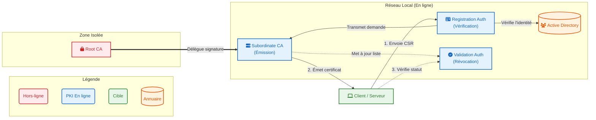
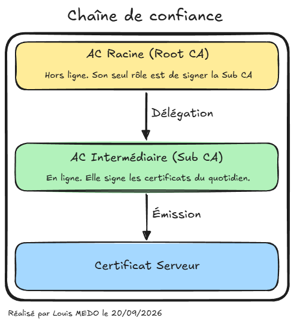
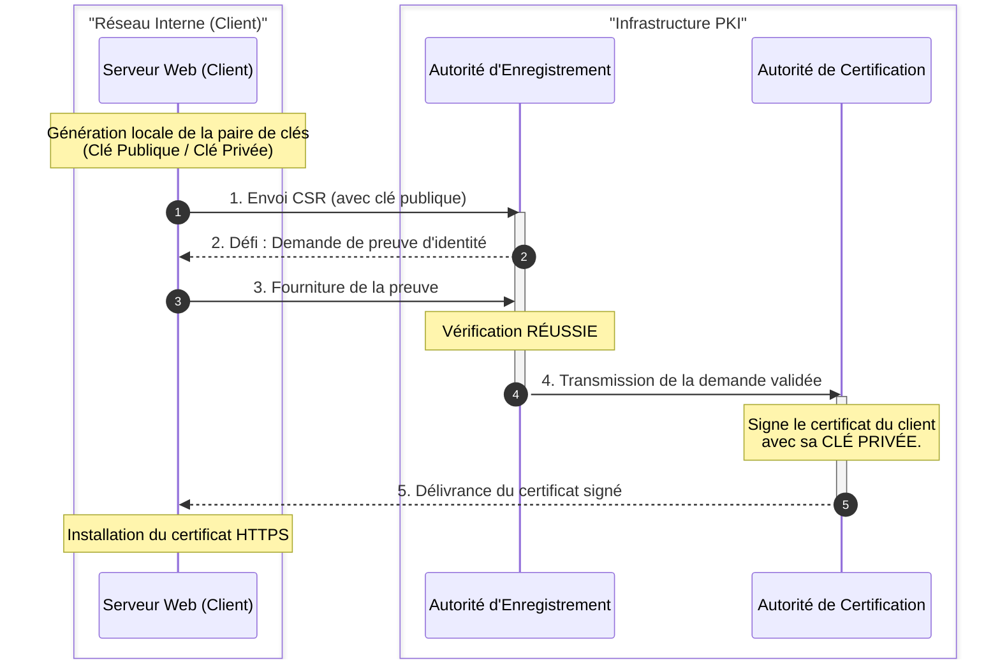
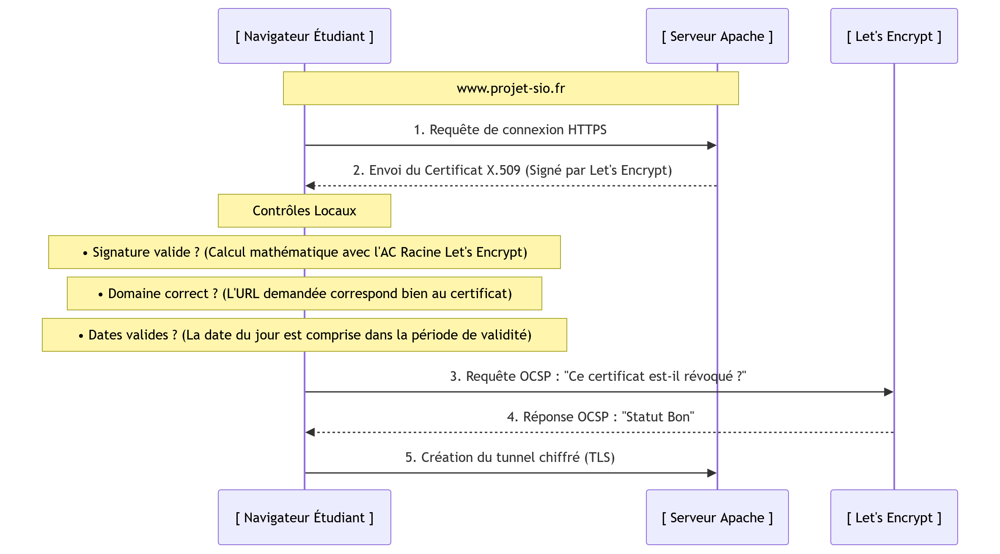
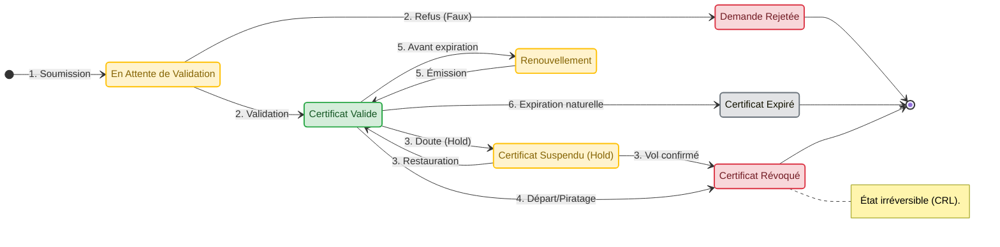

# FICHE DE SYNTHÈSE : L'Infrastructure à Clés Publiques (PKI)

---

!!! note "Méta-informations"

    - **Auteur(s) :** Amine KADA
    - **Date de MAJ :** 30/09/2026

---

## 1. Contexte et Objectifs

Une **PKI (Public Key Infrastructure)** est un ensemble de composants techniques, de procédures et de politiques permettant de créer, gérer, distribuer et révoquer des certificats numériques. 
Son but est d'établir un cadre de confiance pour sécuriser les échanges sur un réseau. Elle garantit 4 piliers fondamentaux de la sécurité :

* **Confidentialité :** Seul le destinataire légitime peut lire la donnée (chiffrement).
* **Authentification :** L'identité de l'émetteur ou du serveur est formellement prouvée.
* **Intégrité :** La donnée n'a pas été altérée en cours de route (utilisation du hachage).
* **Non-répudiation :** L'émetteur ne peut pas nier avoir envoyé le message (signature numérique).

---

## 2. L'Architecture et la Chaîne de Confiance

### 2.1. Les Composants Clés de la PKI

* **Root CA (Autorité de Certification Racine) :** C'est le sommet de la chaîne de confiance. Elle s'auto-signe son propre certificat. Si elle est compromise, toute l'infrastructure est anéantie. C'est pourquoi, en production, ce serveur est éteint et déconnecté du réseau (*Offline Root CA*).
* **Subordinate CA (Autorité Émettrice) :** Ce serveur est en ligne. Il reçoit son autorité de la Root CA. Son rôle est d'émettre et de gérer les certificats au quotidien pour les clients du réseau.
* **RA (Autorité d'Enregistrement) :** Elle vérifie que l'entité (machine ou utilisateur) qui fait la demande (le CSR - *Certificate Signing Request*) a bien le droit d'obtenir ce certificat, sans pour autant le générer elle-même.
* **VA (Autorité de Validation) :** Service chargé de confirmer aux clients réseau si un certificat présenté est toujours valide ou s'il a été révoqué.

### 2.2. Schéma d'Architecture (Two-Tier)

Pour des raisons de sécurité, une PKI d'entreprise utilise généralement cette architecture hiérarchique à deux niveaux :

### 2.3. L'Héritage de la Chaîne de Confiance

Pour des raisons de sécurité critique, une AC Racine ne signe presque jamais les certificats finaux directement. La PKI repose sur une chaîne d'héritage :

Le navigateur de l'utilisateur fait confiance à l'AC Racine par défaut car elle est préinstallée dans son magasin de confiance (ex: magasin Windows). Cependant, l'AC Intermédiaire (Sub CA) n'y figure pas. 
C'est le serveur web qui transmet la chaîne complète au navigateur lors de la connexion. Le navigateur vérifie alors la signature mathématique : **il fait confiance à la Racine → qui a signé l'Intermédiaire → qui a signé le Serveur**. C'est l'héritage de confiance.

---

## 3. Cycle de Vie et Gestion d'un Certificat

### 3.1. Phase d'Obtention (Exemple : Serveur Web et Let's Encrypt)

Prenons l'exemple d'un serveur web qui souhaite passer en HTTPS. Il doit obtenir un certificat signé :

1. **Génération :** Le serveur génère une clé privée (qui restera secrète) et un fichier CSR (Certificate Signing Request) contenant la clé publique et le nom de domaine.
2. **Défi (Challenge) :** L'AC reçoit le CSR et doit valider l'identité du demandeur (Rôle de la RA). L'AC lance un défi (ex: placer un fichier de vérification sur le serveur).
3. **Émission :** Le défi est réussi. L'AC signe numériquement la clé publique et renvoie le certificat X.509 signé.

*Ce processus peut être visualisé sous forme de diagramme de séquence :*

### 3.2. Phase de Vérification (Côté Client)

Lorsqu'un client se connecte à ce serveur web sécurisé :

1. **La présentation :** Le serveur envoie son certificat X.509.
2. **Contrôle d'identité (Vérification mathématique) :** Le navigateur vérifie :
    - *La signature* (grâce au certificat racine préinstallé).
    - *La concordance* (le nom inscrit correspond-il à l'URL ?).
    - *La date de validité*.
3. **Contrôle de révocation :** Le navigateur interroge l'AC en temps réel pour s'assurer que le certificat n'est pas révoqué (via le protocole OCSP).
4. **Confiance établie :** Le "cadenas fermé" s'affiche et une session chiffrée peut débuter.

### 3.3. Révocation : CRL vs OCSP

Si un certificat est compromis (vol de clé privée), il doit être annulé. La VA (Validation Authority) propose deux mécanismes :

| Caractéristique | CRL (Certificate Revocation List) | OCSP (Online Certificate Status Protocol) |
| :--- | :--- | :--- |
| **Mécanisme** | Téléchargement d'une "liste noire" complète. | Requête unitaire en temps réel (API). |
| **Bande passante** | Consommatrice (fichiers parfois lourds). | Très légère (quelques octets). |
| **Actualisation** | Dépend de la mise en cache (asynchrone). | Immédiate (temps réel). |
| **Inconvénient** | Lenteur et délai de mise à jour. | Risque de saturation du serveur de l'AC. |

> [!note] Astuce technique (OCSP Stapling)
> L'industrie utilise aujourd'hui l'**OCSP Stapling** : c'est le serveur web lui-même qui interroge régulièrement l'AC et "agrafe" la preuve de validité de son certificat à sa réponse. Le client gagne du temps en n'ayant pas à faire la requête lui-même.

### 3.4. Diagramme d'État global

Voici le cycle de vie officiel d'un certificat, incluant la suspension temporaire et le renouvellement :

---

## 4. Outils et Cas d'Application Pratiques

### 4.1. PKI Publique vs PKI Interne

* **PKI Publique (ex: Let's Encrypt, DigiCert) :** Fait autorité mondialement sur Internet. Les certificats racines sont préinstallés partout.
* **PKI Interne (Entreprise) :** Fait autorité uniquement sur le réseau local. Idéal pour sécuriser un intranet, un VPN ou le Wi-Fi d'entreprise sans dépendre d'un tiers.

### 4.2. Solutions du Marché (PKI Interne)

1. **Microsoft AD CS (Active Directory Certificate Services) :** S'intègre nativement à l'AD. Utilisé pour le déploiement automatique (Auto-enrollment) de certificats sur les PC Windows via GPO (utilisé pour la sécurité Wi-Fi 802.1X).
2. **Step-CA :** Open-Source et pensé pour le Cloud/DevOps. Géré par API, idéal pour sécuriser automatiquement des conteneurs (Docker) avec des certificats à très courte durée de vie.
3. **XCA (Interface OpenSSL) :** Interface graphique gérant une mini-PKI stockée dans un seul fichier. Excellent pour les laboratoires de test (BTS) ou un tunnel VPN dans une très petite structure.
