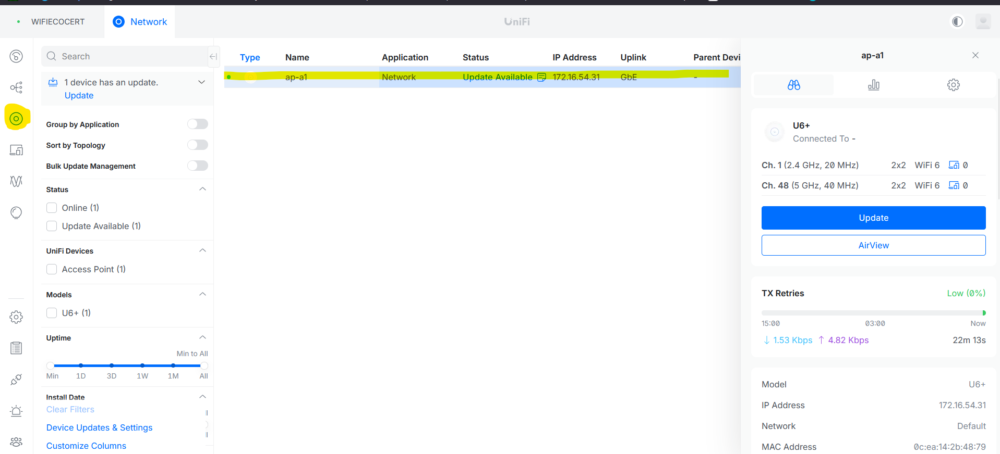
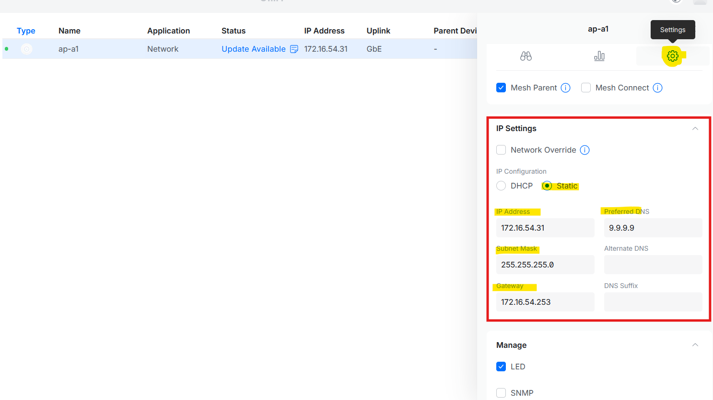

# Ajouter un équipement dans le contrôleur Unifi

---

!!! note "Informations"

    - **Auteur :** Louis MEDO
    - **Date :** 22/09/2026
    - **Domaine :** Réseau

---

## 1. Sommaire

- [1. Sommaire](#1-sommaire)
- [2. Contexte](#2-contexte)
- [3. Préparation du réseau de management](#3-preparation-du-reseau-de-management)
- [4. Adoption dans le contrôleur Unifi](#4-adoption-dans-le-controleur-unifi)
- [5. Configuration de l'adresse IP fixe](#5-configuration-de-ladresse-ip-fixe)

## 2. Contexte

Cette procédure décrit l'intégration d'un nouvel équipement Ubiquiti dans le réseau de production via le contrôleur Unifi. Les équipements s'initialisant sur le réseau `192.168.1.0/24`, une modification temporaire de l'IP du contrôleur est requise avant le provisionnement de l'IP définitive (ex: `172.16.54.31` sur le réseau serveur).

## 3. Préparation du réseau de management {#3-preparation-du-reseau-de-management}

3.1. **Changement d'IP du contrôleur.** Les équipements par défaut possédant l'adresse IP `192.168.1.20` sur le réseau `192.168.1.0/24`, vous devez modifier temporairement l'adresse IP du contrôleur pour la placer dans cette même plage réseau afin d'établir la communication initiale (Procédure standard sur Debian en modifiant le `/etc/network/interfaces`).

## 4. Adoption dans le contrôleur Unifi {#4-adoption-dans-le-controleur-unifi}

4.1. **Connexion à l'interface.** Accéder au portail web d'administration du contrôleur Unifi. [Lien vers l'interface du contrôleur UNIFI](https://172.16.54.30:11443)

> [!note] Identifiants d'accès
> Les identifiants d'administration sont stockés de manière sécurisée dans le gestionnaire de mots de passe Bitwarden.

4.2. **Adoption de l'équipement.** Naviguer dans le menu **Unifi Devices** pour visualiser l'équipement en attente, puis procéder à son adoption.

## 5. Configuration de l'adresse IP fixe

5.1. **Attribution des paramètres réseau.** Depuis les paramètres de l'équipement dans le contrôleur, appliquer sa configuration réseau définitive de production.

- `IP Configuration` : Static
- `IP Address` : [votre_adresse_IP]
- `Subnet Mask` : [votre_masque_réseau]
- `Gateway` : [votre_passerelle]
- `Preferred DNS` : 9.9.9.9
- `Alternative DNS` : 1.1.1.1

5.2. **Restauration du contrôleur.** Remettre l'adresse IP du serveur hébergeant le contrôleur à sa configuration standard d'origine (ex: `172.16.54.30`).
