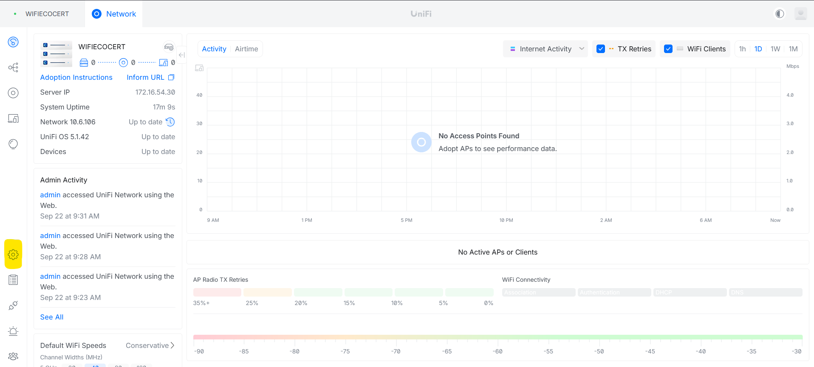
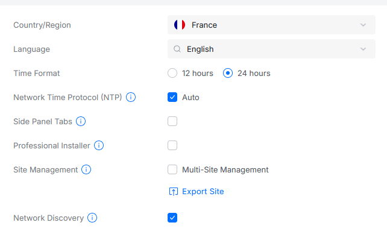

# Configuration du contrôleur Unifi (Post Installation)

---

!!! note "Informations"

    - **Auteur :** Louis MEDO
    - **Date :** 22/09/2026
    - **Domaine :** Réseau

---

## 1. Sommaire

- [1. Sommaire](#1-sommaire)
- [2. Contexte](#2-contexte)
- [3. Accès à l'interface d'administration](#3-acces-a-linterface-dadministration)
- [4. Configuration des paramètres système](#4-configuration-des-parametres-systeme)

## 2. Contexte

Cette procédure détaille les actions de configuration système à effectuer immédiatement après l'installation d'un contrôleur Ubiquiti Unifi. Elle permet de standardiser les paramètres régionaux et d'activer la découverte réseau pour faciliter l'adoption des futurs équipements.

## 3. Accès à l'interface d'administration {#3-acces-a-linterface-dadministration}

3.1. **Connexion au portail web.** Connectez-vous à l'interface Unifi en utilisant l'URL suivant [https://unifi.local.ecocert4.fr](https://172.16.54.30:11443).

3.2. **Navigation vers les paramètres.** Une fois authentifié, aller dans le menu symbolisé par un engrenage (Settings) situé dans la barre de navigation latérale gauche.

## 4. Configuration des paramètres système {#4-configuration-des-parametres-systeme}

4.1. **Application de la configuration.** Depuis le menu des paramètres, naviguer dans la section **System** et modifier les informations pour correspondre aux standards de l'infrastructure.

Assurez-vous de définir les variables suivantes :

- `Country/Region` : France
- `Time Format` : 24 hours
- `Network Discovery` : Coché (activé)

> [!note] Découverte réseau
> L'activation de la fonctionnalité **Network Discovery** est indispensable pour que le contrôleur puisse identifier automatiquement les nouveaux points d'accès et commutateurs branchés sur le réseau de management.

