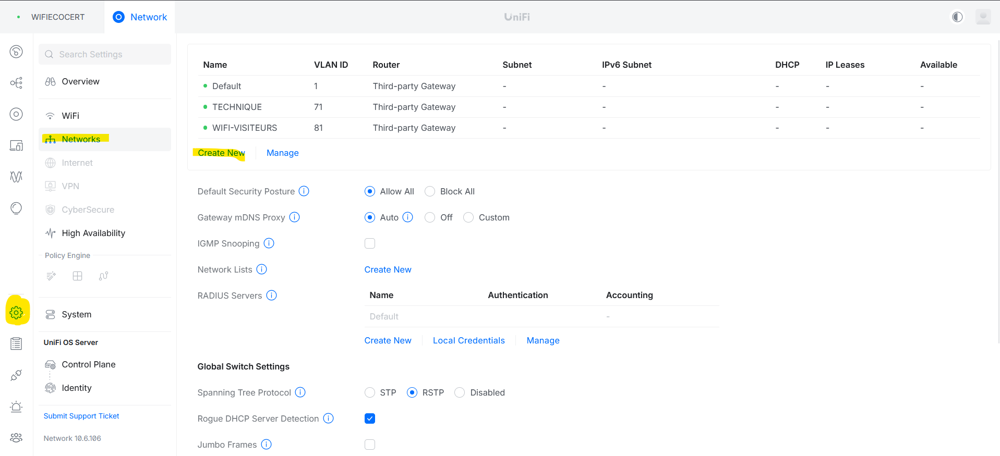
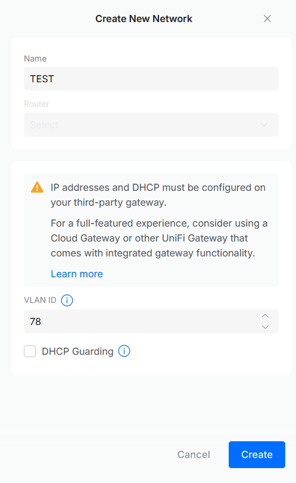
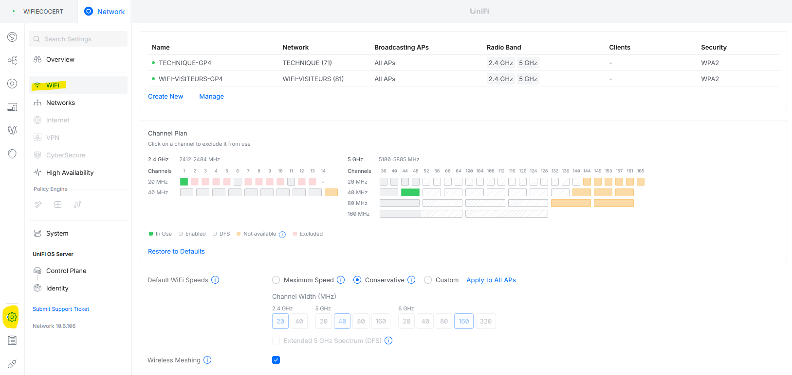
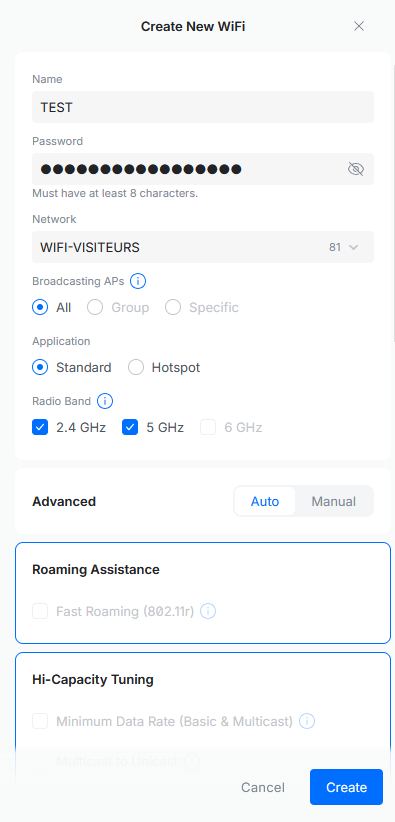

# Création d'un réseau WIFI sur le contrôleur Unifi

---

!!! note "Informations"

    - **Auteur :** Louis MEDO
    - **Date :** 22/09/2026
    - **Domaine :** Réseau

---

## 1. Sommaire

- [1. Sommaire](#1-sommaire)
- [2. Contexte](#2-contexte)
- [3. Ajout du réseau logique (VLAN)](#3-ajout-du-reseau-logique-vlan)
- [4. Création du réseau sans fil (Wi-Fi)](#4-creation-du-reseau-sans-fil-wi-fi)

## 2. Contexte

Cette procédure détaille les étapes de provisionnement d'un nouveau réseau local (VLAN) et le déploiement de son réseau sans fil (SSID) associé via le contrôleur Ubiquiti Unifi. Elle garantit l'isolation du trafic et la diffusion correcte des accès Wi-Fi sur l'infrastructure.

## 3. Ajout du réseau logique (VLAN) {#3-ajout-du-reseau-logique-vlan}

3.1. **Accès au panneau de configuration des réseaux.** Se connecter à l'interface d'administration ([Lien vers le contrôleur Unifi](https://172.16.54.30:11443)), aller dans l'engrenage (Paramètres) puis sélectionner **Networks**, et enfin cliquer sur **Create New**.

3.2. **Création du réseau.** Rentrer les informations de votre réseau en spécifiant le nom et l'ID du VLAN (par exemple 228).

## 4. Création du réseau sans fil (Wi-Fi) {#4-creation-du-reseau-sans-fil-wi-fi}

4.1. **Accès au panneau de configuration Wi-Fi.** Toujours depuis l'interface web du contrôleur Unifi, aller dans l'engrenage puis sélectionner la section **WiFi**.

4.2. **Déploiement du SSID.** Cliquer sur **Create New**, puis donner la configuration à votre réseau wifi en paramétrant le nom (ex: `test`) et en l'associant au VLAN cible.

> [!note] Association au réseau
> Lors de la création du SSID, il est impératif de sélectionner le réseau (VLAN) préalablement créé à l'étape 3 dans le champ `Network` pour assurer le bon routage des clients sans fil.

