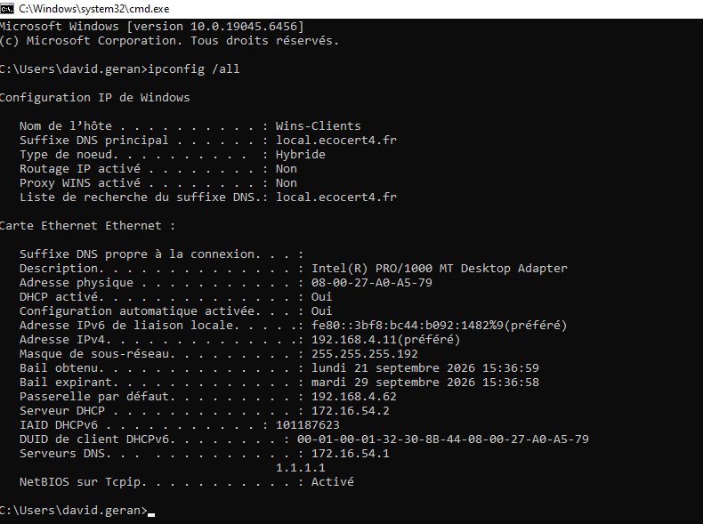
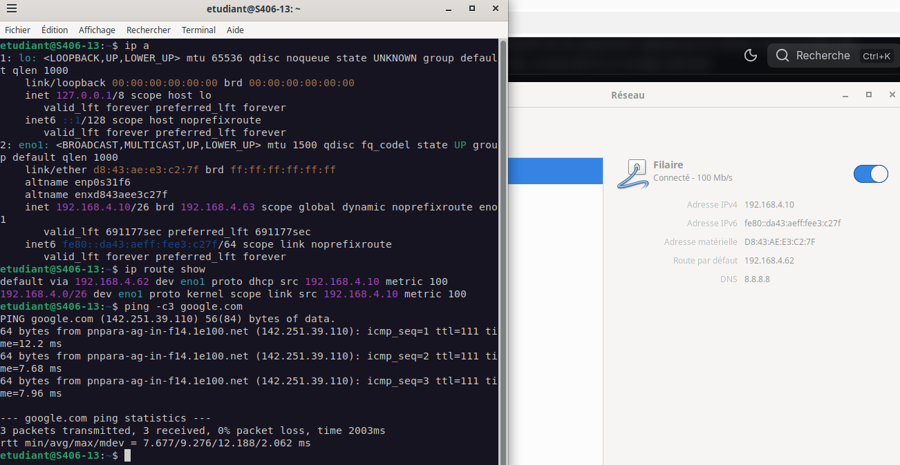

# Fiche recette du serveur DHCP avec des machines clientes


---

- **Auteur :** Amine KADA
- **Date :** 21/09/2026
- **Domaine :** Debian / Réseau

---

## 1. Sommaire

- [1. Sommaire](#1-sommaire)
- [2. Contexte](#2-contexte)
- [3. Validation sur un client Debian simple](#3-validation-sur-un-client-debian-simple)
- [4. Validation sur un client Windows (Membre de l'AD)](#4-validation-sur-un-client-windows-membre-de-lad)

## 2. Contexte

Validation du bon fonctionnement du service Kea-dhcp4 (serveur DHCP) via deux machines clientes. Cette fiche recette permet de s'assurer de l'attribution dynamique correcte des adresses IP, des passerelles et des serveurs DNS aux postes selon leur réseau respectif, validant ainsi la configuration du serveur DHCP et l'opérationnalité des relais DHCP sur l'architecture.

## 3. Validation sur un client Debian simple

3.1. **Vérification de l'interface réseau.** Sur le premier poste client sous Debian (poste simple n'étant pas intégré à l'Active Directory), la carte réseau est configurée pour obtenir son adressage automatiquement via DHCP.

3.2. **Obtention du bail DHCP.** Une fois la machine démarrée et connectée au réseau, elle interroge le serveur DHCP. On exécute la commande permettant de lister les interfaces et vérifier l'adresse attribuée :

```bash title="Terminal"
ip a
```



!!! success "Validation"
    L'interface réseau obtient bien une adresse IP cohérente avec la plage configurée sur le serveur DHCP Kea. Cela confirme la bonne distribution des baux sur le segment du client Debian.

## 4. Validation sur un client Windows (Membre de l'AD)

4.1. **Connexion au poste.** Sur le second poste client fonctionnant sous Windows, on se connecte avec un compte utilisateur membre du domaine Active Directory (ex: un utilisateur du service Administration).

4.2. **Vérification de la configuration réseau.** Afin de certifier l'adressage dynamique sur ce réseau spécifique, on ouvre l'invite de commandes et on vérifie les paramètres réseaux appliqués.

```cmd title="Terminal"
ipconfig
```



!!! success "Validation"
    Le poste Windows reçoit une adresse IP correspondant bien à la plage d'adresses définie pour son groupe de travail (le VLAN Administration). La distribution s'opère correctement, prouvant que le relais DHCP et les pools d'adresses fonctionnent parfaitement.
