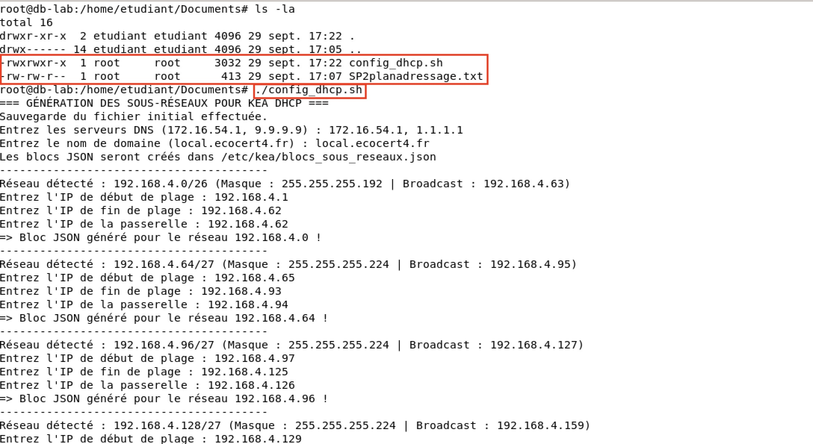
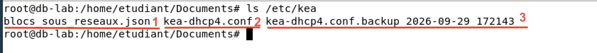
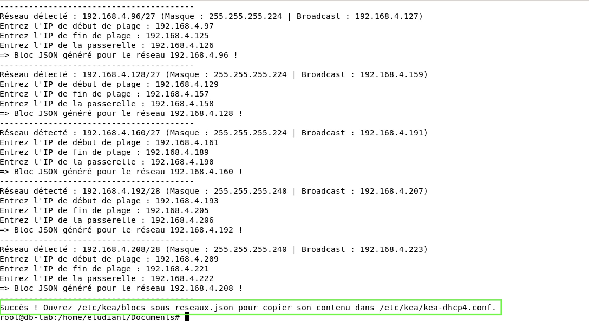
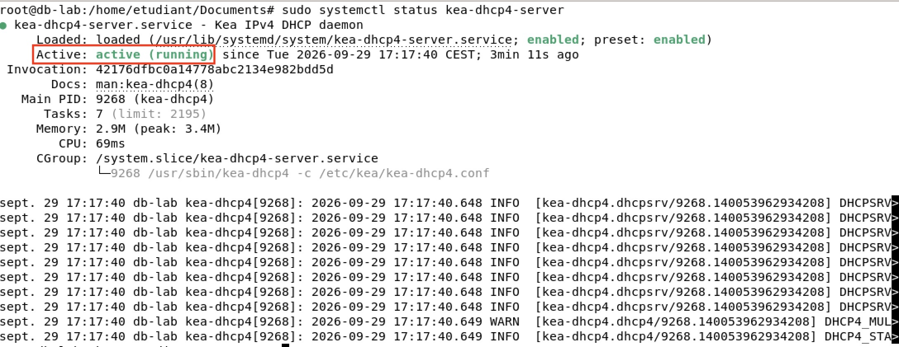

# Fiche Recette : Exécution du script d'automatisation DHCP

---

!!! note "Informations"

    - **Auteur :** Amine KADA
    - **Date :** 29/09/2026
    - **Domaine :** Debian / Automatisation

---

## 1. Sommaire

- [1. Sommaire](#1-sommaire)
- [2. Contexte](#2-contexte)
- [3. Validation de l'exécution interactive](#3-validation-de-lexecution-interactive)
- [4. Validation de la génération du fichier de configuration](#4-validation-de-la-generation-du-fichier-de-configuration)
- [5. Validation du service Kea DHCP](#5-validation-du-service-kea-dhcp)

---

## 2. Contexte

Cette fiche de recette a pour but de valider le bon fonctionnement du script Bash d'automatisation (`config_dhcp.sh`). Les tests permettent de confirmer que le script interagit correctement avec l'administrateur système pour récolter les informations (DNS, nom de domaine, plages d'IP, passerelles), qu'il génère dynamiquement des blocs de configuration valides au format JSON pour le serveur Kea DHCP, et que le service redémarre sans erreur avec cette nouvelle configuration.

---

## 3. Validation de l'exécution interactive

3.1. **Lancement du script et saisie des paramètres.**
L'exécution du script doit d'abord réaliser une sauvegarde automatique de la configuration initiale de Kea, puis demander les paramètres globaux (Serveurs DNS et Nom de domaine) avant de boucler sur les sous-réseaux pour demander les plages et passerelles.

- Les invites de commandes (prompts) s'affichent correctement pour récolter les données réseau de l'administrateur.

- Le script effectue la sauvegarde du fichier `kea-dhcp4.conf` (Numéro 2) au nom de `kea-dhcp4.conf.backup_yyyy-mm-dd-serie` (numéro 3) et la création du fichier dhcp fait par le script : `bloc_sous_reseaux.json` (Numéro 1) .

*Validation : L'interactivité du script et la sauvegarde automatique fonctionnent comme attendu.*

---

## 4. Validation de la génération du fichier de configuration

4.1. **Vérification du fichier de sortie JSON.**
Une fois le script terminé, le fichier de résultat `/etc/kea/blocs_sous_reseaux.json` est généré avec succès.

- Le terminal affiche le message final confirmant l'écriture du fichier.

*Validation : Le code JSON généré est syntaxiquement correct et a été écrit avec succès pour être intégré dans le fichier de configuration principal `kea-dhcp4.conf`.*

---

## 5. Validation du service Kea DHCP

5.1. **Statut du démon.**
Après intégration des blocs JSON et rechargement de la configuration, le service Kea DHCP doit être opérationnel et à l'écoute des requêtes client.

- Le statut renvoie un code `active (running)`.

*Validation : La configuration générée par le script est parfaitement supportée par le serveur Kea.*
