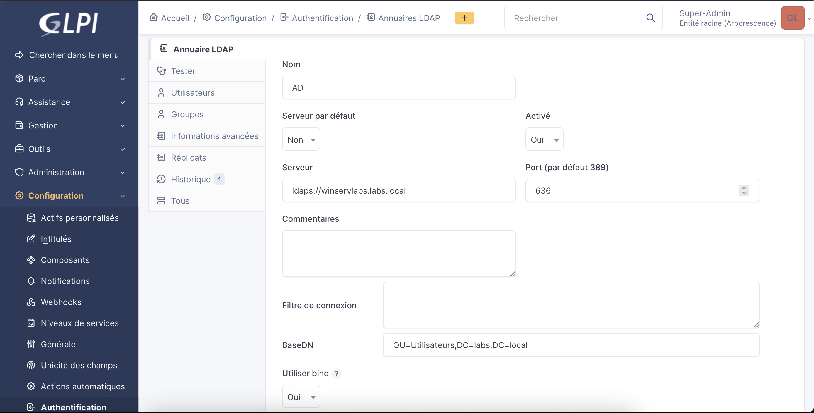
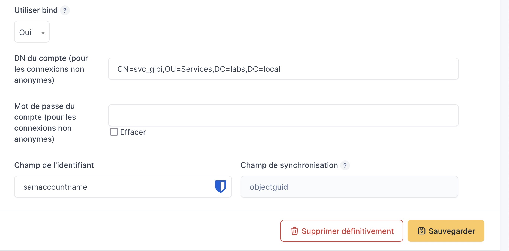
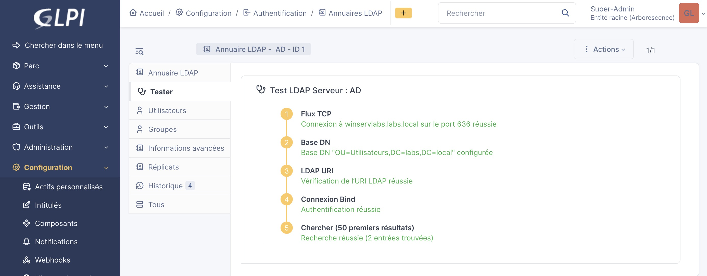
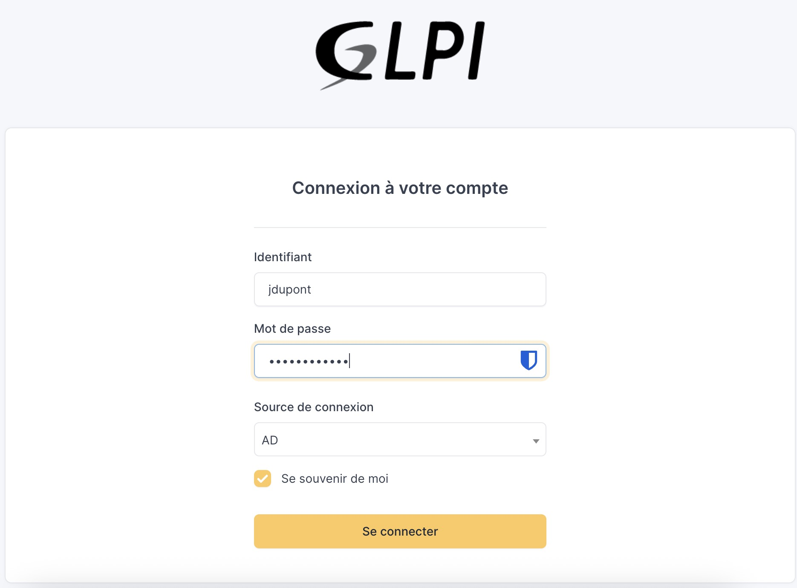

# Configuration LDAPS et synchronisation dans GLPI

---

!!! note "Informations"

    - **Auteur :** Amine KADA
    - **Date :** 28/09/2026
    - **Domaine :** Debian / Identité et Gestion de Parc

---

## 1. Sommaire

- [1. Sommaire](#1-sommaire)
- [2. Contexte](#2-contexte)
- [3. Configuration de l'annuaire LDAPS](#3-configuration-de-lannuaire-ldaps)
- [4. Validation de la connectivité GLPI](#4-validation-de-la-connectivite-glpi)
- [5. Test de connexion applicative](#5-test-de-connexion-applicative)

---

## 2. Contexte

Cette procédure s'inscrit dans la continuité du déploiement de l'infrastructure LDAPS côté Windows Server. Elle détaille le paramétrage final du connecteur d'annuaire au sein de l'interface GLPI, permettant d'authentifier de manière sécurisée les utilisateurs du domaine Active Directory `local.ecocert4.fr`.

---

## 3. Configuration de l'annuaire LDAPS

3.1. **Formulaire de configuration du serveur d'annuaire.** Naviguer dans GLPI : `Configuration` > `Authentification` > `Annuaires LDAP` > `Ajouter` (modèle **Active Directory**).

| Champ | Valeur préconisée | Description |
| :--- | :--- | :--- |
| **Nom** | `AD` | Libellé d'affichage de la source LDAP |
| **Serveur par défaut** | `Oui` | Utilisé prioritairement lors des ouvertures de session |
| **Actif** | `Oui` | Active le connecteur pour l'authentification |
| **Serveur** | `ldaps://adecocert.local.ecocert4.fr` | URI FQDN sécurisée (LDAPS obligatoire) |
| **Port** | `636` | Port réseau chiffré TLS |
| **Filtre de connexion** | `(&(objectClass=user)(objectCategory=person)(!(userAccountControl:1.2.840.113556.1.4.803:=2)))` | Exclut les comptes d'ordinateurs et désactivés |
| **BaseDN** | `OU=Utilisateurs,DC=local,DC=ecocert4,DC=fr` | Conteneur racine ciblant les comptes utilisateurs |
| **Utiliser bind** | `Oui` | Force l'authentification via un compte de lecture |
| **RootDN** | `CN=svc_glpi,OU=Services,DC=local,DC=ecocert4,DC=fr` | Identifiant DN du compte de service |
| **Mot de passe root** | `SvcGlpiSecuredPassword2026!` | Mot de passe associé au compte `svc_glpi` |
| **Champ de l'identifiant** | `samaccountname` | Attribut d'authentification Active Directory |
| **Champ de synchronisation** | `objectguid` | Identifiant immuable pour le suivi d'annuaire |

> [!note] Informations avancées
> Dans l'onglet **Informations avancées**, laisser le paramètre **Utiliser TLS** sur **Non**. L'activation de cette option correspond à l'usage de StartTLS, incompatible avec l'appel direct d'un endpoint `ldaps://` sur le port 636.

## 4. Validation de la connectivité GLPI

4.1. **Tests internes du moteur.** Accéder à l'onglet **Tester** de la fiche annuaire. Le moteur GLPI déroule l'analyse séquentielle :
1. *Flux TCP* : Connexion sur le port 636 réussie.
2. *Base DN* : Validité syntaxique du conteneur `OU=Utilisateurs,DC=local,DC=ecocert4,DC=fr`.
3. *LDAP URI* : Analyse du protocole d'URI validée.
4. *Connexion Bind* : Authentification réussie pour le compte de liaison.
5. *Chercher* : Interrogation positive avec affichage des enregistrements détectés.

## 5. Test de connexion applicative

5.1. **Validation avec un compte utilisateur AD.**
- Ouvrir une fenêtre de navigation privée.
- Naviguer sur `https://172.16.54.40`.
- Saisir l'identifiant `jdupont` (sans suffixe `@local.ecocert4.fr` ni préfixe `ECOCERT4\`) et le mot de passe utilisateur Active Directory associé.

- La session s'ouvre avec le rôle attribué par défaut (**Self-Service / Post-Only**).

