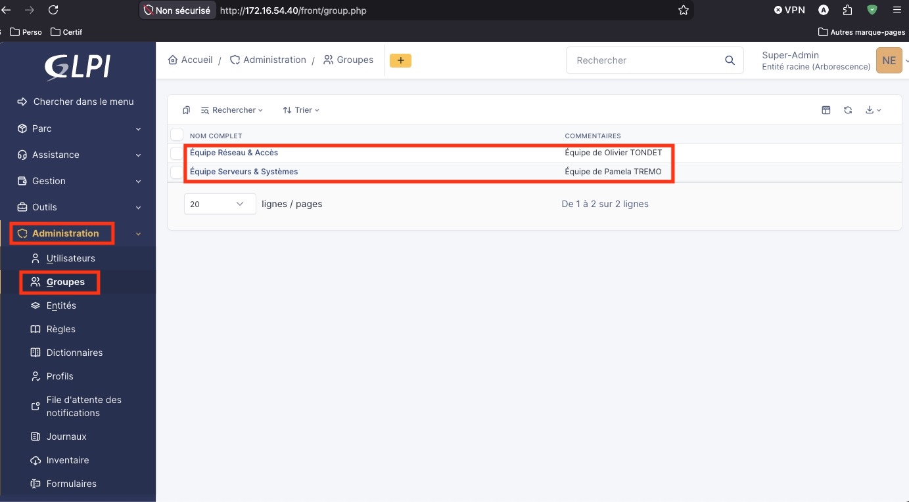
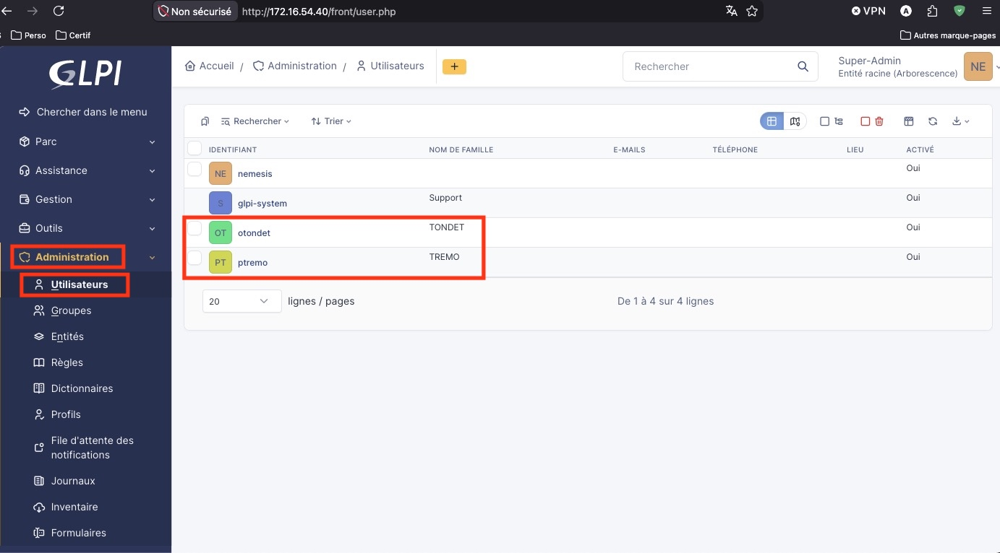
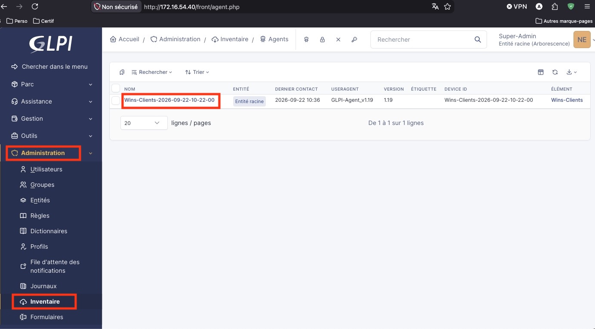
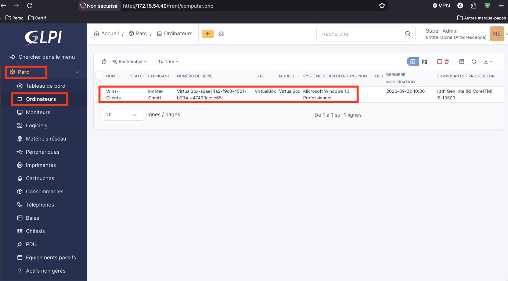
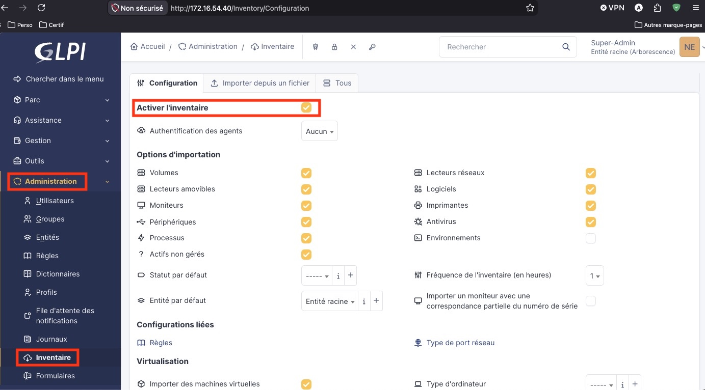

# Configuration du serveur GLPI (Helpdesk & Inventaire)


- **Auteur :** KADA Amine
- **Date :** 23/09/2026
- **Domaine :** Debian / GLPI

---

## 1. Sommaire

- [1. Sommaire](#1-sommaire)
- [2. Contexte](#2-contexte)
- [3. Déploiement et Sécurisation du Serveur](#3-deploiement-et-securisation-du-serveur)
- [4. Configuration du Helpdesk (ITIL)](#4-configuration-du-helpdesk-itil)
- [5. Automatisation de l'Inventaire de Parc (GPO)](#5-automatisation-de-linventaire-de-parc-gpo)

## 2. Contexte

Le serveur **GLPIECOCERT** (172.16.54.40, Passerelle : 172.16.54.253) hébergé sous Debian 13 a pour rôle la gestion d'inventaire et des tickets d'incident. Ce service s'intègre à l'infrastructure Active Directory (`local.ecocert4.fr`) pour la remontée automatisée des composants matériels et logiciels des postes de travail via le déploiement d'un agent.

## 3. Déploiement et Sécurisation du Serveur {#3-deploiement-et-securisation-du-serveur}

3.1.  **Sécurisation de l'accès web**. Restreindre la lecture du serveur web (Apache/Nginx) au dossier racine `/public` afin d'empêcher l'exposition de fichiers sensibles.

```bash title="Terminal"
# Exemple de modification de la configuration du vhost
DocumentRoot /var/www/glpi/public
```

- `DocumentRoot` : Définit le répertoire racine du site web. Cette action répond aux exigences strictes de sécurité introduites par GLPI 11.

## 4. Configuration du Helpdesk (ITIL)

4.1.  **Création des groupes et affectations**. Afin de structurer la gestion des incidents selon les normes ITIL, l'assistance est divisée selon les domaines d'expertise des administrateurs.

| Administrateur | Identifiant | Profil | Groupe affecté | Peut être assigné |
| :--- | :--- | :--- | :--- | :--- |
| Olivier TONDET | `otondet` | Admin (entité racine) | Équipe Réseau & Accès | :lucide-check: Oui |
| Pamela TREMO | `ptremo` | Admin (entité racine) | Équipe Serveurs & Systèmes | :lucide-check: Oui |





4.2.  **Paramétrage du routage automatique**. Les catégories d'incidents sont liées aux groupes pour permettre un dispatching ITIL sans intervention manuelle.

| Catégorie de ticket | Groupe assigné (Routage automatique) |
| :--- | :--- |
| Problème réseau / Interconnexion | Équipe Réseau & Accès (Olivier) |
| Problème Serveur / AD | Équipe Serveurs & Systèmes (Pamela) |

## 5. Automatisation de l'Inventaire de Parc (GPO)

5.1.  **Création de la stratégie de déploiement**. Sur le contrôleur de domaine (`ADECOCERT`), mise en place d'une GPO pour déployer silencieusement `GLPI-Agent.msi` (11.0.9) et configurer son URL de contact.

```registry title="Paramètre de Registre (GPO)"
HKEY_LOCAL_MACHINE\SOFTWARE\GLPI-Agent
"server"="https://172.16.54.40/"
```

- `server` : La valeur de la clé de registre pointe sur l'URL courte. Cela permet de contourner l'erreur HTTP 404 causée par la restriction de sécurité du dossier web (`/public`).



5.2.  **Application et Validation**. Sur les postes clients Windows, forcer l'application des stratégies et vérifier la remontée des données dans l'interface d'administration.

```cmd title="Terminal (Client Windows)"
gpupdate /force
```

- `gpupdate /force` : Oblige le poste client à récupérer immédiatement les nouvelles directives de la GPO. Les ordinateurs apparaissent ensuite automatiquement dans le menu **Parc > Ordinateurs** de l'interface GLPI avec leurs caractéristiques complètes.




