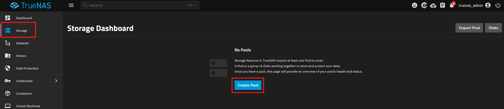
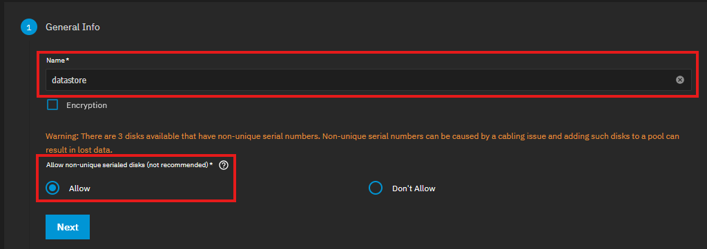
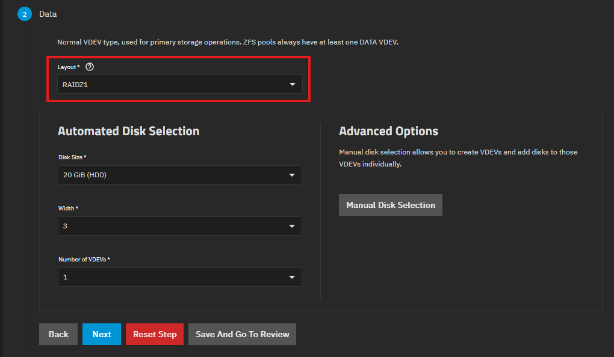
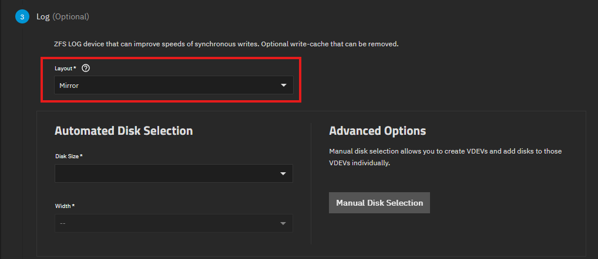
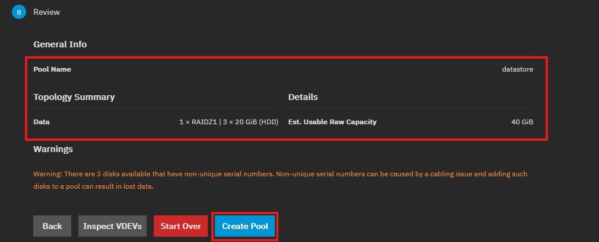
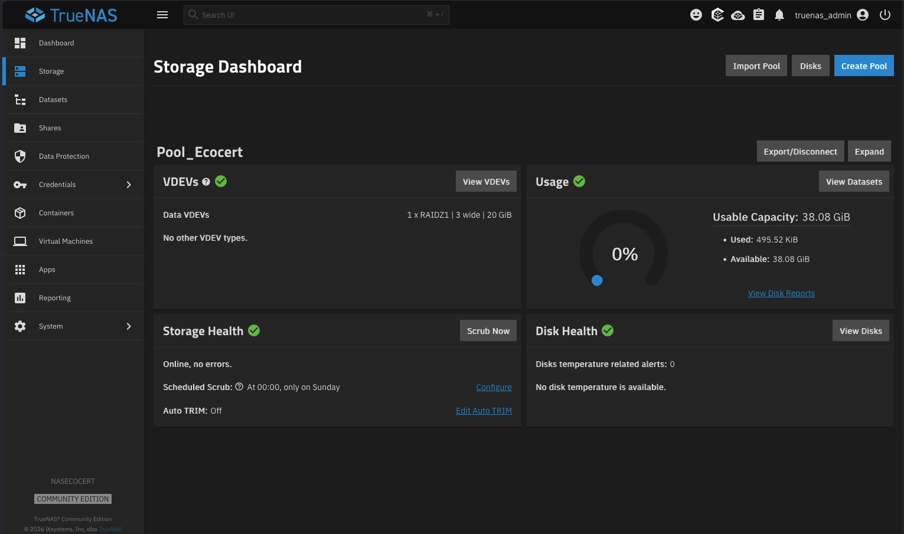

# Création d'un pool TrueNAS

---

!!! note "Informations"

    - **Auteur :** Louis MEDO
    - **Date :** 26/09/2026
    - **Domaine :** Debian

---

## 1. Sommaire

- [1. Sommaire](#1-sommaire)
- [2. Contexte](#2-contexte)
- [3. Accès au gestionnaire de stockage](#3-acces-au-gestionnaire-de-stockage)
- [4. Informations générales](#4-informations-generales)
- [5. Topologie des données - RAIDZ1](#5-topologie-des-donnees---raidz1)
- [6. Configuration des journaux ZIL](#6-configuration-des-journaux-zil)
- [7. Options ZFS avancées](#7-options-zfs-avancees)
- [8. Validation](#8-validation)
- [9. Vérification finale du Pool](#9-verification-finale-du-pool)

## 2. Contexte

Cette procédure détaille la création d'un pool de stockage ZFS basé sur 3 disques virtuels au sein d'une instance TrueNAS virtualisée. En environnement virtuel, l'absence de numéros de série matériels uniques sur les disques nécessite une configuration d'exception. Le stockage est provisionné en RAIDZ1 afin de garantir la continuité de service (tolérance à la panne d'un disque) tout en optimisant la capacité utile du *datastore*.

## 3. Accès au gestionnaire de stockage {#3-acces-au-gestionnaire-de-stockage}

3.1. **Navigation vers le tableau de bord.** Déployez le menu de stockage pour initier la création du pool.

- `Storage` : Module de gestion globale des disques physiques et des pools ZFS sous TrueNAS.
- `Create Pool` : Déclenche l'assistant de création pour agréger de nouveaux disques.

## 4. Informations générales {#4-informations-generales}

4.1. **Définition du nom et contournement de sécurité.** Nommez le point de montage et autorisez l'utilisation de disques virtualisés.

- `Name` : Identifiant logique de la grappe de stockage (ici `datastore`).
- `Allow non-unique serialed disks` : Paramètre important en virtualisation. ZFS piste nativement les disques via leur numéro de série pour éviter la corruption de la grappe. Les hyperviseurs émulant des disques génériques, cette protection doit être désactivée.

> [!warning] Bonnes pratiques
> Sur une infrastructure bare-metal (matériel physique), l'option `Allow non-unique serialed disks` ne doit **jamais** être activée, sous peine de risquer une perte totale de données lors d'un changement de port SATA/SAS.

## 5. Topologie des données - RAIDZ1 {#5-topologie-des-donnees---raidz1}

5.1. **Configuration du VDEV de données.** Définissez la géométrie de stockage sur le premier groupe virtuel (VDEV).

- `VDEV (Virtual Device)` : Entité logique de base dans ZFS regroupant un ou plusieurs disques. Un pool est la somme d'un ou plusieurs VDEVs.
- `RAIDZ1` : Implémentation ZFS équivalente au RAID 5 (Parité répartie). Permet la perte d'un disque sans perte de données.
- `Width` : Le nombre de disques engagés dans le VDEV (3 disques de 20 GiB).

## 6. Configuration des journaux ZIL {#6-configuration-des-journaux-zil}

6.1. **Ajout d'un périphérique SLOG.** Définissez, si souhaité, l'accélérateur d'écritures synchrones.

- `Log` : Emplacement dédié au ZFS Intent Log (ZIL). Utilisé pour stocker temporairement mais de façon persistante les écritures synchrones rapides avant leur écriture sur le pool plus lent (généralement un SSD NVMe ou Optane).
- `Stripe` : Agrégation sans redondance (équivalent RAID 0).

> [!note] Architecture de production
> Si un périphérique de Log est utilisé en production, il est fortement recommandé d'utiliser une topologie `Mirror` pour le SLOG. La perte d'un SLOG en mode Stripe lors d'un crash système entraîne la perte des transactions synchrones en attente.

## 7. Options ZFS avancées {#7-options-zfs-avancees}

7.1. **Ignorer ou configurer les VDEVs secondaires.** Validez les étapes 4 à 7 en cliquant sur `Next` si votre architecture ne nécessite pas de périphériques spécialisés.

- `Spare` : Disque de secours passif (Hot-Spare). ZFS l'intégrera automatiquement pour initier un *resilver* (reconstruction) si un disque actif du pool vient à défaillir.

- `Cache (L2ARC)` : *Level 2 Adaptive Replacement Cache*. SSD de lecture additionnel agissant comme extension de la mémoire vive (ARC) pour les blocs fréquemment lus.

- `Metadata` : VDEV (Special Allocation Class) isolé, constitué de disques très véloces pour stocker exclusivement les métadonnées (arborescences, inodes) ou les très petits blocs. Accélère la navigation dans les répertoires.

- `Dedup` : VDEV de stockage pour les tables de déduplication (DDT). La déduplication en ligne ZFS est extrêmement coûteuse en RAM (~1 à 5 Go de RAM par To de données).

## 8. Validation {#8-validation}

8.1. **Revue de la topologie et application.** Contrôlez le résumé de l'agencement et lancez le formatage.

- `Est. Usable Raw Capacity` : Capacité utile estimée (ici 40 GiB, soit la capacité de 2 disques sur 3, un disque étant sacrifié pour la parité RAIDZ1).
- `Warnings` : L'alerte rouge rappelle de manière préventive que les numéros de série ne sont pas uniques.
- `Create Pool` : Provisionne les disques, construit le système de fichiers ZFS et effectue le montage automatique.

## 9. Vérification finale du Pool {#9-verification-finale-du-pool}

9.1. **Validation du datastore**. Une fois le pool créé, vérifiez sa présence et sa capacité dans le gestionnaire.

1. L'interface retourne automatiquement sur la page **Storage > Pools**.
2. Vérifiez que le pool **datastore** est bien monté et fonctionnel (statut *ONLINE*).

## 10. Tâches de maintenance et d'intégrité (Bonnes Pratiques) {#10-taches-maintenance}

Pour garantir la pérennité des données sur ZFS, il est **indispensable** de configurer des tâches automatisées de vérification (particulièrement scruté en environnement de production).

10.1. **Configuration des tests S.M.A.R.T**.
1. Naviguer dans `Data Protection` > `S.M.A.R.T. Tests`.
2. Créer un test `Short` quotidien et un test `Long` hebdomadaire sur tous les disques du Pool. Cela permet d'anticiper les pannes matérielles.

10.2. **Planification des Tâches Scrub (ZFS Scrub)**.
1. Naviguer dans `Data Protection` > `Scrub Tasks`.
2. S'assurer qu'une tâche est planifiée pour le pool `datastore` (par défaut, TrueNAS configure un scrub tous les 35 jours, mais une fréquence de 14 jours est recommandée). Le Scrub va lire chaque bloc de donnée et le comparer à sa somme de contrôle (checksum) pour réparer les bits corrompus (bit rot).
