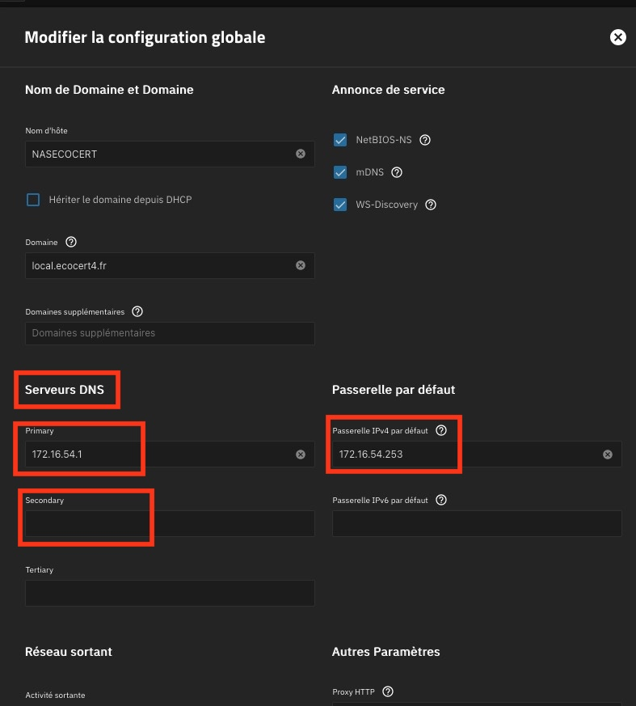
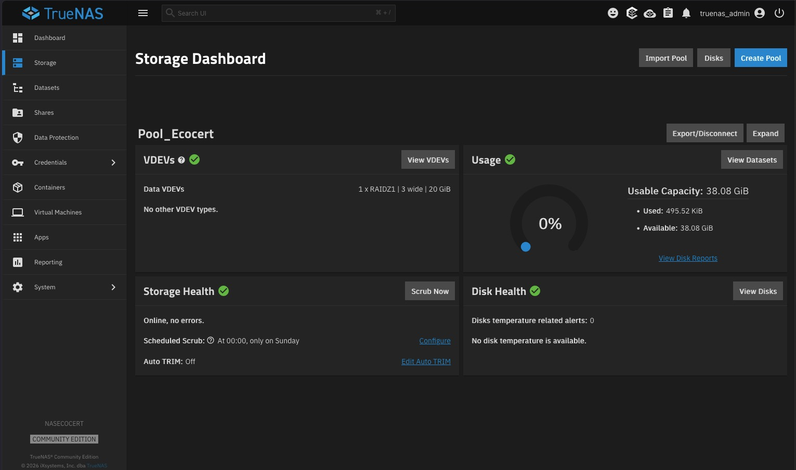
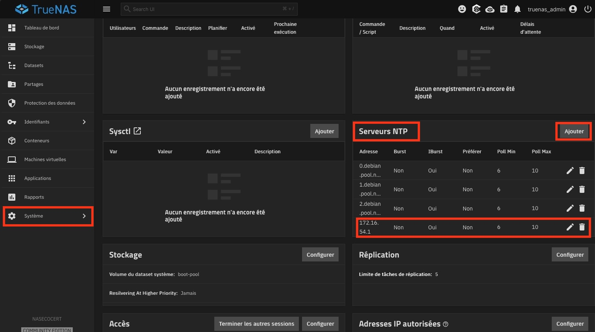
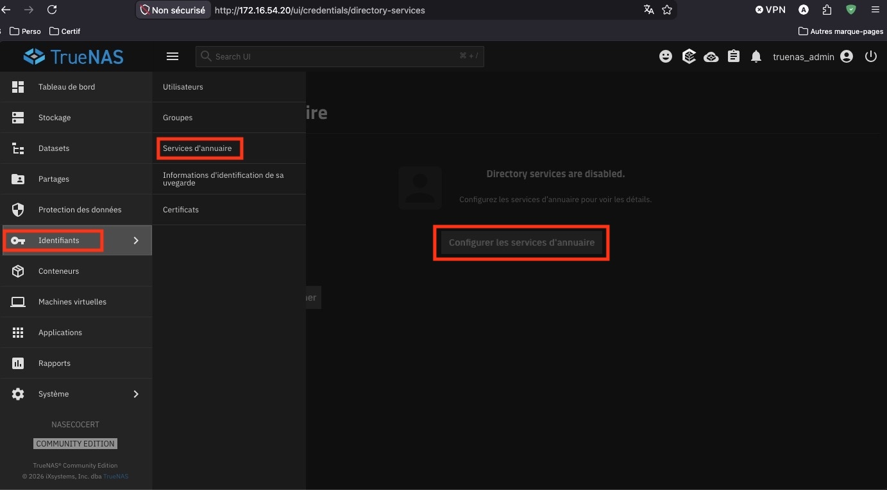
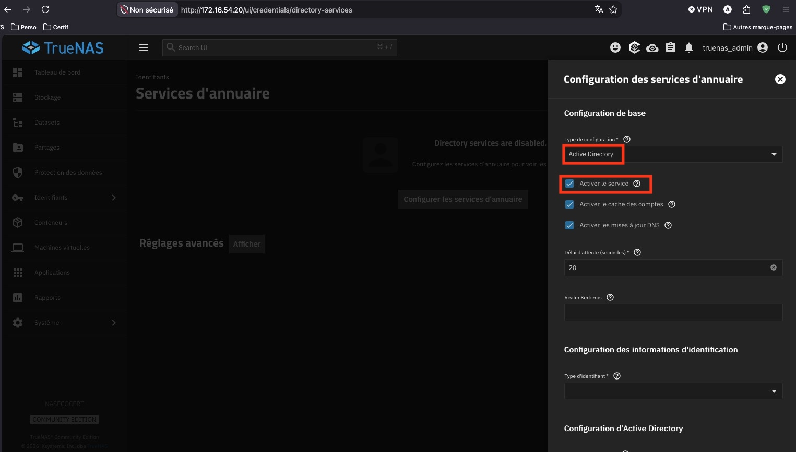
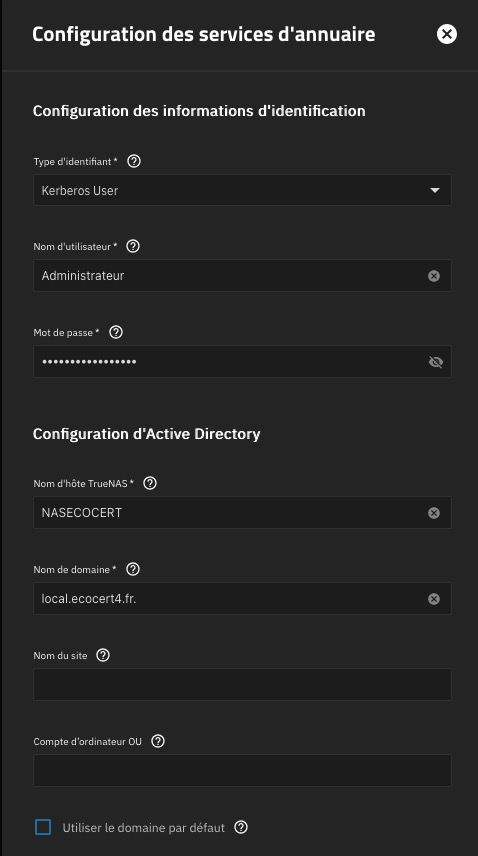
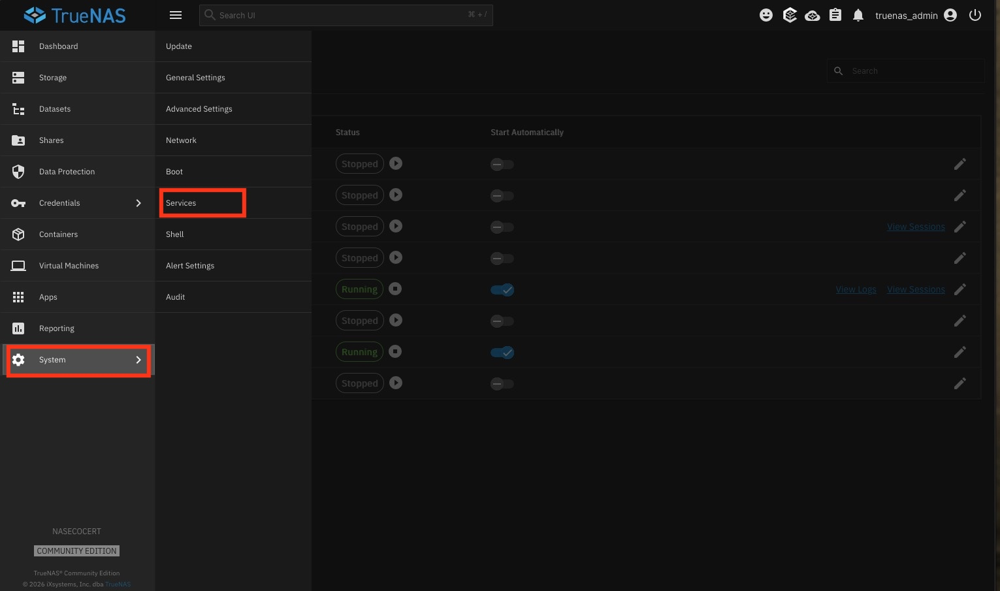
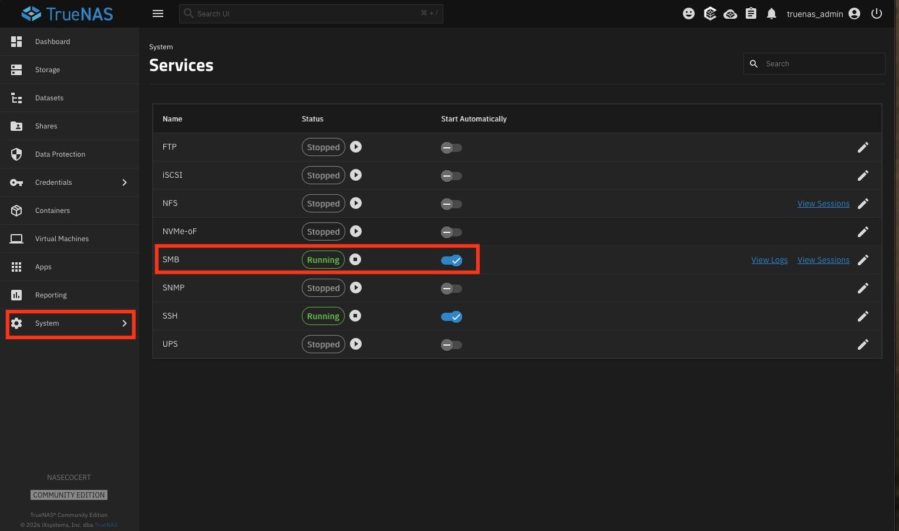
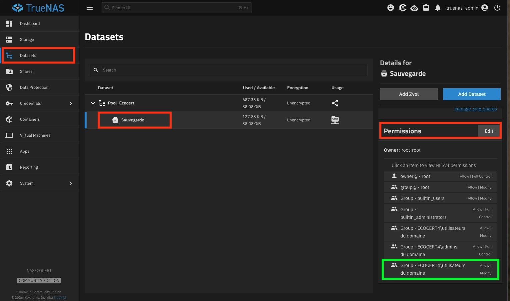
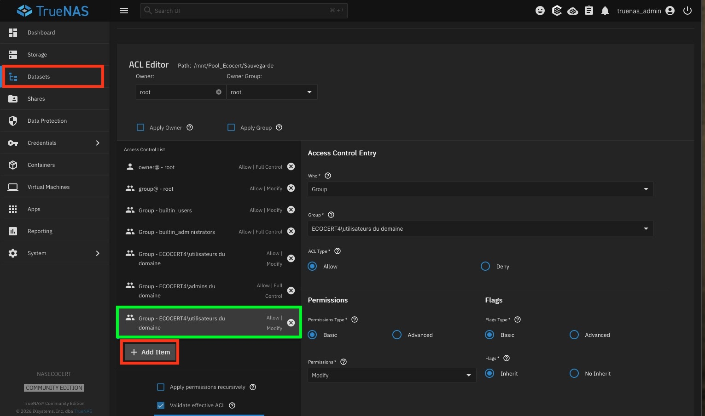

---

description: Initialisation du stockage RAIDZ1 TrueNAS, configuration réseau, et intégration Active Directory (SMB).

---

# Configuration Initiale et Réseau TrueNAS

- **Auteur :** KADA Amine
- **Date :** 23/09/2026
- **Domaine :** NAS / Stockage

---

## 1. Sommaire

- [1. Sommaire](#1-sommaire)
- [2. Contexte](#2-contexte)
- [3. Configuration de l'Interface Réseau](#3-configuration-de-linterface-reseau)
- [4. Configuration Globale (Passerelle & DNS)](#4-configuration-globale-passerelle--dns)
- [5. Création du Pool de Stockage (RAID 5)](#5-creation-du-pool-de-stockage-raid-5)
- [6. Configuration NTP & Active Directory](#6-configuration-ntp--active-directory)
- [7. Partage de fichiers (SMB) et Droits (ACL)](#7-partage-de-fichiers-smb-et-droits-acl)
- [8. Validation Côté Client (Windows)](#8-validation-cote-client-windows)

## 2. Contexte

Le serveur **NASECOCERT** (172.16.54.20) tourne sous TrueNAS. Il a pour rôle d'initialiser l'espace de stockage réseau avec une tolérance aux pannes (RAID 5, min. 20 Go) dédié à la gestion des sauvegardes. Le service doit s'intégrer à l'annuaire Active Directory (`local.ecocert4.fr`) pour gérer l'authentification et les droits d'accès.

## 3. Configuration de l'Interface Réseau

3.1.  **Attribution de l'adresse IP fixe**. Cette étape est réalisée depuis la console locale de TrueNAS.

1. Dans le menu de la console TrueNAS, accédez à `Configure Network Interfaces`.
2. Éditez la carte réseau principale (ex: `ens18`).
3. Ajoutez un Alias avec l'adresse IP fixe `172.16.54.20/24`.

> [!important] Connectivité
> Sans cette étape, le NAS ne peut pas communiquer sur le réseau local ni être administré via l'interface web.

## 4. Configuration Globale (Passerelle & DNS)

4.1.  **Paramétrage du routage**. Configuration effectuée depuis la console locale.

1. Accédez au menu `Global Configuration`.
2. Renseignez la passerelle par défaut : `172.16.54.253`.
3. Renseignez le serveur DNS : `172.16.54.1` (Contrôleur de domaine).

> [!warning] DNS Secondaire
> Ne pas renseigner de "DNS Secondary" avec un DNS public (ex: 8.8.8.8). En effet, le système risquerait de rejeter les requêtes ou de faire la demande à l'extérieur plutôt qu'en interne, brisant la résolution de nom pour le domaine `local.ecocert4.fr`.

## 5. Création du Pool de Stockage (RAID 5)

5.1.  **Initialisation des disques**. Cette étape s'effectue depuis l'interface web d'administration (`http://172.16.54.20`).

1. Rendez-vous dans le menu **Storage > Pools**.
2. Cliquez sur **Add** pour créer un nouveau pool en sélectionnant au moins 3 disques virtuels disponibles.
3. Validez la création en choisissant l'agencement **RAIDZ1** (équivalent au RAID 5 logiciel sous ZFS) pour initialiser l'espace de stockage. Vérifiez d'avoir au moins **20 Go** d'espace disponible pour les données.

## 6. Configuration NTP & Active Directory

6.1.  **Configuration NTP (Pré-requis)**. L'intégration à un domaine Active Directory requiert une synchronisation temporelle stricte.

1. Naviguez dans **System > NTP Servers**.
2. Ajoutez ou modifiez un serveur NTP pour pointer vers votre contrôleur de domaine (`172.16.54.1`).

6.2.  **Intégration à l'annuaire (Active Directory)**. Liaison du NAS avec l'annuaire pour l'authentification centralisée.

1. Allez dans le menu **Directory Services > Active Directory**.
2. Renseignez le domaine `local.ecocert4.fr` et les identifiants de l'administrateur du domaine.

## 7. Partage de fichiers (SMB) et Droits (ACL)

7.1.  **Activation du service SMB**. Permet le partage de fichiers sur le réseau Windows.

1. Naviguez dans le menu **Services**.
2. Activez le service **SMB** et cochez "Start Automatically".

7.2.  **Création du partage et gestion des permissions (ACL)**.

1. Naviguez dans **Sharing > Windows Shares (SMB)** et cliquez sur **Add**.
2. Sélectionnez le chemin correspondant à votre pool de stockage (ex: `Sauvegardes`).
3. Modifiez les droits d'accès (ACL) sur le Dataset pour autoriser les utilisateurs et groupes de l'Active Directory.

## 8. Validation Côté Client (Windows)

8.1.  **Accès au partage réseau**. Vérification depuis un poste client joint au domaine.

1. Ouvrez l'Explorateur de fichiers Windows.
2. Cliquez sur **Réseau** ou tapez directement `\\172.16.54.20` ou `\\NASECOCERT` dans la barre d'adresse.
3. Vérifiez la présence du dossier partagé et testez la lecture/écriture.

