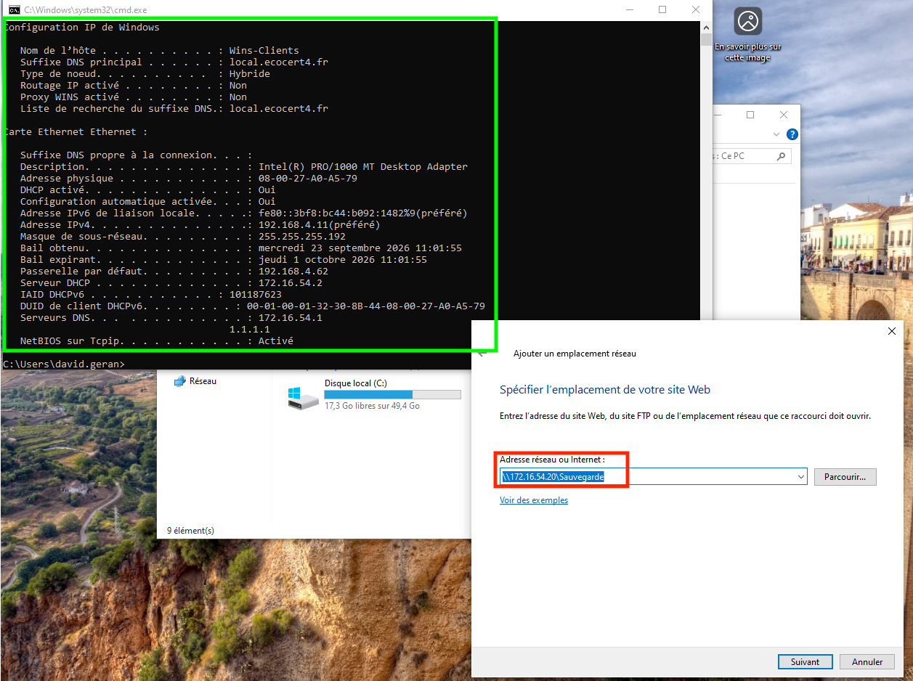
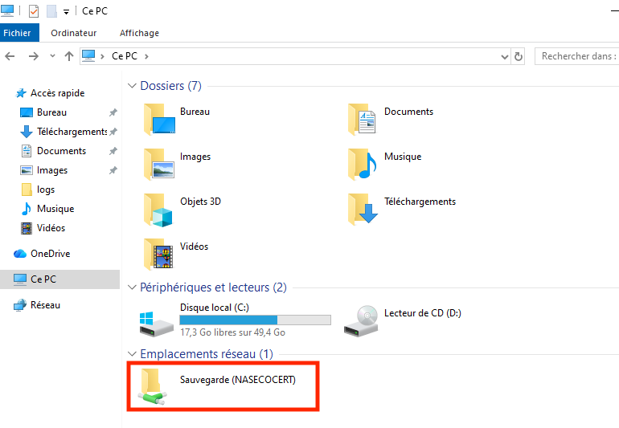

# Validation de l'accès au partage réseau (NAS)


---

!!! note "Informations"

    - **Auteur :** KADA Amine
    - **Date :** 23/09/2026
    - **Domaine :** Windows / NAS

---

## 1. Sommaire

- [1. Sommaire](#1-sommaire)
- [2. Contexte](#2-contexte)
- [3. Validation de la configuration réseau du client](#3-validation-de-la-configuration-reseau-du-client)
- [4. Accès et montage du lecteur réseau](#4-acces-et-montage-du-lecteur-reseau)

## 2. Contexte

Cette fiche recette valide la bonne communication entre un poste client Windows du domaine `local.ecocert4.fr` et le serveur de stockage **NASECOCERT** (172.16.54.20). Elle atteste de la résolution DNS, de l'attribution IP correcte et du fonctionnement du partage de fichiers SMB (dossier partagé "Sauvegarde").

## 3. Validation de la configuration réseau du client

3.1.  **Vérification de l'adressage IP et du DNS**. Sur le poste client Windows, ouvrez une invite de commandes et vérifiez les paramètres réseau pour confirmer l'appartenance au domaine et la configuration DHCP.

```cmd title="Terminal (Client Windows)"
ipconfig /all
```

- `Suffixe DNS principal` : Doit correspondre à `local.ecocert4.fr`.
- `Serveurs DNS` : Doit pointer vers le contrôleur de domaine (`172.16.54.1`).

## 4. Accès et montage du lecteur réseau

4.1.  **Ajout de l'emplacement réseau**. Depuis l'assistant Windows "Ajouter un emplacement réseau", connectez le dossier partagé du NAS.

- `Adresse réseau ou Internet` : Saisissez l'URI cible `\\172.16.54.20\Sauvegarde`.



4.2.  **Vérification du montage**. Ouvrez l'explorateur de fichiers Windows dans la vue **Ce PC**.

- `Emplacements réseau` : Le dossier partagé doit apparaître sous le nom **Sauvegarde (NASECOCERT)** et être accessible.


