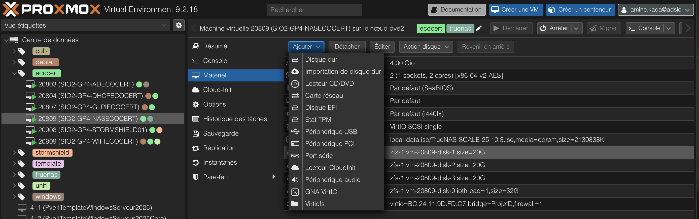
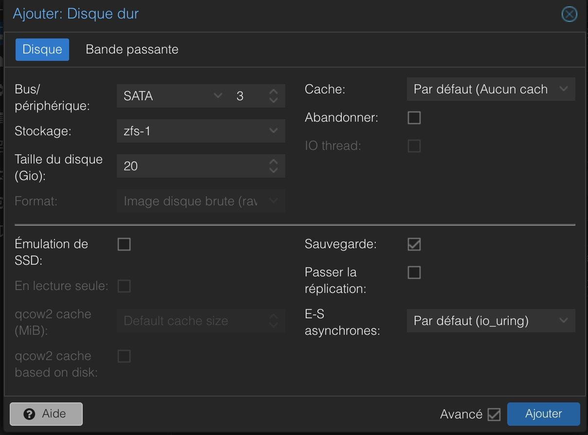

# Installation du NAS TrueNAS

- **Auteur :** KADA Amine
- **Date :** 23/09/2026
- **Domaine :** NAS / Stockage

---

## 1. Sommaire

- [1. Sommaire](#1-sommaire)
- [2. Contexte](#2-contexte)
- [3. Création de la Machine Virtuelle (Proxmox)](#3-creation-de-la-machine-virtuelle-proxmox)
- [4. Ajout des disques de stockage (SATA)](#4-ajout-des-disques-de-stockage-sata)
- [5. Installation du système TrueNAS](#5-installation-du-systeme-truenas)

## 2. Contexte

Le serveur **NASECOCERT** nécessite un socle solide pour opérer en tant que serveur de stockage principal. Cette documentation couvre exclusivement les étapes matérielles (virtuelles) sur l'hyperviseur Proxmox, notamment la création de la VM et l'ajout de disques dédiés, ainsi que l'installation bas niveau du système d'exploitation TrueNAS.

## 3. Création de la Machine Virtuelle (Proxmox)

3.1.  **Configuration matérielle de base**. Création de la VM sur le nœud Proxmox.

- `OS` : Linux (Sélectionner l'image ISO de TrueNAS préalablement uploadée).
- `Système` : Carte graphique par défaut, Qemu Agent activé.
- `Disque système` : Créer un premier disque (ex: 32 Go) qui hébergera uniquement le système d'exploitation TrueNAS. Ne **pas** utiliser ce disque pour le stockage de données.
- `Réseau` : Associer la carte réseau du groupe 4 qui est "PorjetD" (VLAN 54).

## 4. Ajout des disques de stockage (SATA)

4.1.  **Ajout des disques de données**. Afin de constituer notre grappe RAID 5 (RAIDZ1) lors de la configuration logicielle, il faut présenter des disques de données additionnels à TrueNAS. 

1. Dans l'interface Proxmox de la VM, naviguez dans **Hardware > Add > Hard Disk**.
2. **Bus/Device :** Sélectionnez `SATA`.
3. **Storage :** Sélectionnez le stockage sous-jacent (ex: `local-zfs`).
4. **Disk size (GiB) :** Spécifiez `20` pour créer un disque de 20 Go.
5. Répétez cette opération pour obtenir le nombre de disques requis (au moins 3 disques de 20 Go pour un RAID 5 fonctionnel).

> [!important] Architecture ZFS
> L'utilisation du bus SATA et la présentation de disques bruts permet à TrueNAS d'avoir un accès direct aux disques pour gérer efficacement le système de fichiers ZFS et la redondance.

## 5. Installation du système TrueNAS

5.1.  **Déploiement de l'OS**. Démarrage de la machine virtuelle et configuration initiale du programme d'installation.

1. **Amorce :** Démarrez la VM. Le menu d'installation de TrueNAS s'affiche.
2. **Choix :** Sélectionnez `1. Install/Upgrade`.
3. **Sélection du disque :** Cochez (avec la touche *Espace*) **uniquement** le disque système créé à l'étape 3 (le disque principal de 32 Go). Ne sélectionnez surtout pas les disques SATA de 20 Go fraîchement ajoutés.
4. **Mot de passe :** Saisissez un mot de passe fort pour l'utilisateur `root` (accès console et web).
5. **Amorçage :** Choisissez le mode `BIOS` (ou `UEFI` selon la configuration de votre VM Proxmox).
6. **Finalisation :** À la fin de l'installation, retirez l'ISO virtuelle (depuis l'interface Proxmox) et redémarrez la machine (`Reboot`). L'adresse IP de base s'affichera dans la console.
