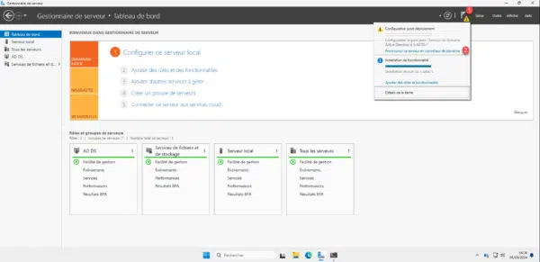
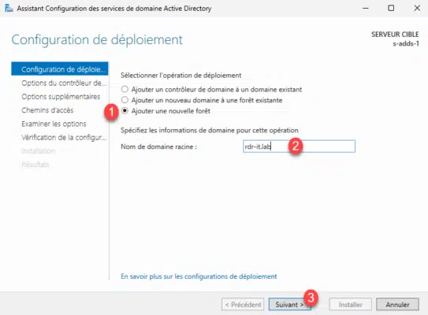
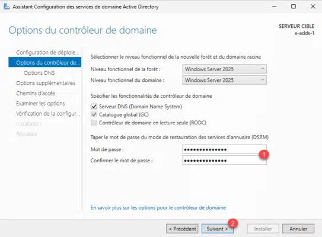
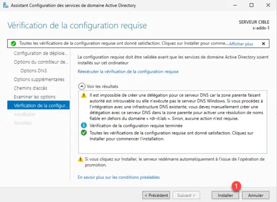

# Configuration et intégration AD


---

- **Auteur :** Amine KADA
- **Date :** 14/09/2026
- **Domaine :** Windows serveur

---

## 1. Sommaire

- [1. Sommaire](#1-sommaire)
- [2. Contexte](#2-contexte)
- [3. Promotion du contrôleur de domaine](#3-promotion-du-controleur-de-domaine)
- [4. Intégration des utilisateurs](#4-integration-des-utilisateurs)

## 2. Contexte

Finalisation du déploiement en promouvant le serveur en tant que premier contrôleur de domaine de la nouvelle forêt `ecocert.lan`. Une fois l'Active Directory opérationnel, un script PowerShell automatisé permet d'intégrer massivement les utilisateurs de l'organisation à partir d'un fichier CSV.

## 3. Promotion du contrôleur de domaine

3.1.  **Démarrage de l'assistant de promotion.** Cliquer sur "Promouvoir ce serveur en contrôleur de domaine" dans le Gestionnaire de serveur.



3.2.  **Configuration du déploiement.** Choisir "Ajouter une nouvelle forêt" et spécifier le nom du domaine racine de l'entreprise (ex: `local.ecocertX.lan`).



3.3.  **Options du contrôleur de domaine.** Définir le mot de passe de restauration des services d'annuaire nécessaire en cas de maintenance ou de récupération.



3.4.  **Vérification de la configuration.** S'assurer que toutes les vérifications préalables ont réussi avant de cliquer sur "Installer" pour lancer la promotion finale.



## 4. Intégration des utilisateurs

4.1.  **Correction du script PowerShell d'importation.** Le script original `ad-config-origin.ps1` comportait des défauts empêchant la création des comptes depuis le CSV. Il doit être corrigé avant son exécution.

!!! bug "Erreurs corrigées dans le script"

    - La variable de création `$ligne.login` est invalide car le fichier CSV ne contient pas d'en-tête "login".
    - L'adresse email était mal formatée, reprenant uniquement le nom de domaine.
    - La cmdlet `Get-ADUser` ne déclenchait pas d'erreur interceptable, rendant le bloc `catch` inefficace.

```powershell title="ad-config-fixed.ps1" hl_lines="37 41 48"
# ATTENTION, si le script est lancé depuis un éditeur powershell (powershell ISE)
# il faut que l'éditeur ait été lancé en tant qu'administrateur
################################################################

###################
# ATTENTION : 1. Changez le mode de sécurité de PowerShell afin d'autoriser l'exécution de scripts locaux
# Set-ExecutionPolicy RemoteSigned  (en ligne de commandes)
###################

###################
# ATTENTION : la variable $fichier doit être modifiée
# en tenant compte du répertoire où vous stockez le fichier users.csv
###################
$fichier=Import-Csv -Delimiter ";" C:\PWS\users.csv


###################
# ATTENTION : la variable $domaine doit être modifiée
# en tenant compte de votre nom de domaine
###################
$domaine="ecocert"
$domainecomplet=$domaine+".lan"
$path="DC=$domaine,DC=lan"
write-host $path


#Import des utilisateurs
foreach ($ligne in $fichier) {
    Write-Host "LIGNE:"
    Write-Host $ligne
    $ligne.nom = $ligne.nom.toUpper()
	
	# login = prenom.nom en minuscule
	$n=$ligne.nom.toLower()
	$p=$ligne.prenom.toLower()
	$login=$p+"."+$n
	Write-Host "Utilisateur : $login"   

	$email=$login+"@"+$domainecomplet
	
	try {
		$user=Get-ADUser -LDAPFilter "(sAMAccountName=$login)" -ErrorAction Stop
		Write-Host "Utilisateur $login déjà existant"
	}
	catch {
        write-host $ligne.nom
        Write-Host $ligne.prenom
		New-ADUser -Name "$($ligne.nom) $($ligne.prenom)" -SamAccountName "$login" -GivenName "$($ligne.prenom)" -Surname "$($ligne.nom)" -DisplayName "$($ligne.prenom) $($ligne.nom)" -EmailAddress $email -UserPrincipalName "$login@$domainecomplet" -ChangePasswordAtLogon $true -AccountPassword(ConvertTo-SecureString "etudiant_007" -AsPlainText -Force) -Enabled $true
        Write-Host "Utilisateur $login créé"
	}
}
```

- `-ErrorAction Stop` : Intercepte correctement l'erreur si l'utilisateur n'existe pas, permettant de passer au bloc `catch`.
- `$login` : Utilisation de la variable concaténée correctement (`prenom.nom`).
- `$email` : L'adresse est reconstruite avec le format attendu `login@domaine`.