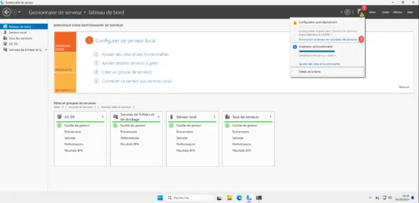
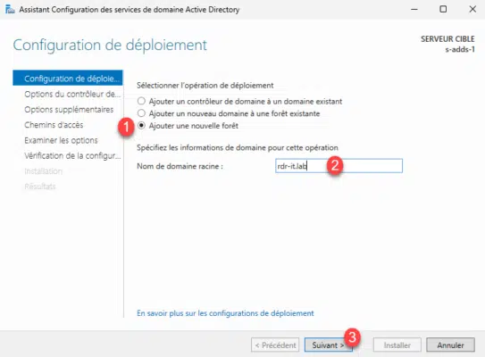
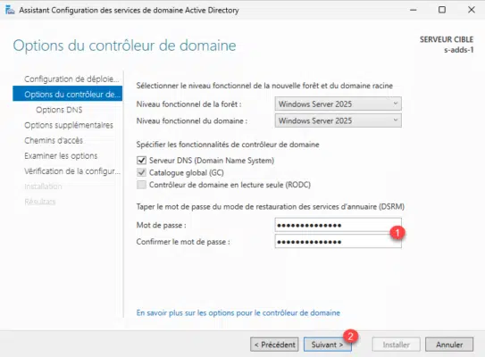
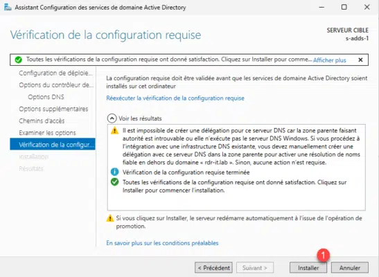

# Configuration et intégration AD

---

- **Auteur :** Amine KADA
- **Date :** 14/09/2026
- **Domaine :** Windows serveur

---

## 1. Sommaire

- [1. Sommaire](#1-sommaire)
- [2. Contexte](#2-contexte)
- [3. Promotion du contrôleur de domaine](#3-promotion-du-controleur-de-domaine)
- [4. Intégration des utilisateurs](#4-integration-des-utilisateurs)

## 2. Contexte

Finalisation du déploiement en promouvant le serveur en tant que premier contrôleur de domaine de la nouvelle forêt `ecocert.lan`. Une fois l'Active Directory opérationnel, un script PowerShell automatisé permet d'intégrer massivement les utilisateurs de l'organisation à partir d'un fichier CSV.

## 3. Promotion du contrôleur de domaine {#3-promotion-du-controleur-de-domaine}

3.1.  **Démarrage de l'assistant de promotion.** Cliquer sur "Promouvoir ce serveur en contrôleur de domaine" dans le Gestionnaire de serveur.

3.2.  **Configuration du déploiement.** Choisir "Ajouter une nouvelle forêt" et spécifier le nom du domaine racine de l'entreprise (ex: `local.ecocertX.lan`).

3.3.  **Options du contrôleur de domaine.** Définir le mot de passe de restauration des services d'annuaire nécessaire en cas de maintenance ou de récupération.

3.4.  **Vérification de la configuration.** S'assurer que toutes les vérifications préalables ont réussi avant de cliquer sur "Installer" pour lancer la promotion finale.

## 4. Intégration des utilisateurs {#4-integration-des-utilisateurs}

4.1.  **Correction du script PowerShell d'importation.** Le script original `ad-config-origin.ps1` comportait des défauts empêchant la création des comptes depuis le CSV. Il doit être corrigé avant son exécution.

[script pour la création des utilisateurs](./assets/configuration-ad-windows/creationUtilisateurEcocert.ps1)

- `-ErrorAction Stop` : Intercepte correctement l'erreur si l'utilisateur n'existe pas, permettant de passer au bloc `catch`.
- `$login` : Utilisation de la variable concaténée correctement (`prenom.nom`).
- `$email` : L'adresse est reconstruite avec le format attendu `login@domaine`.
