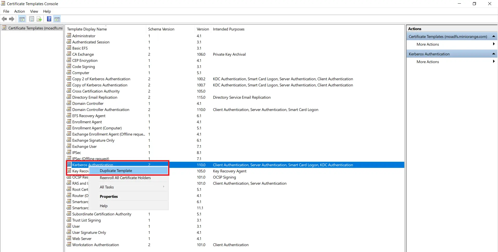
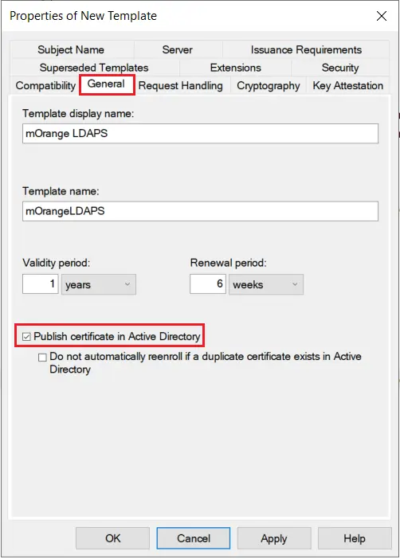
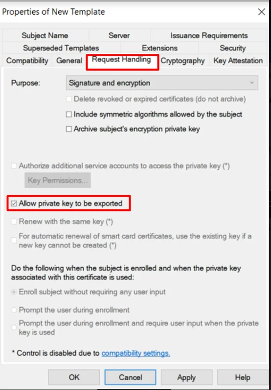
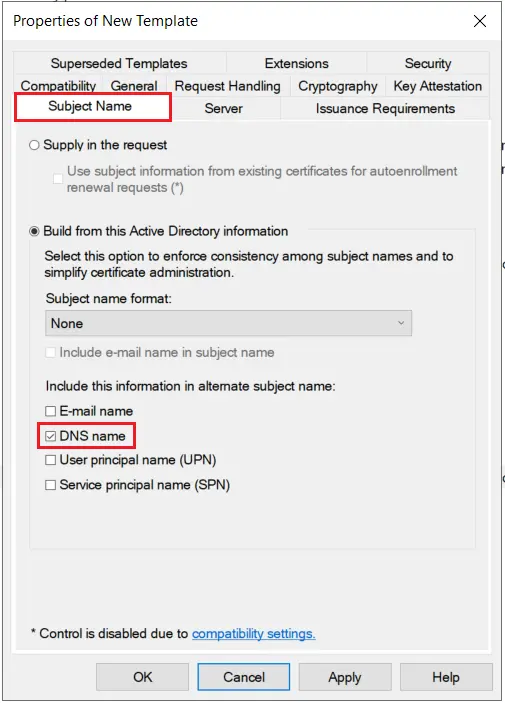

# Déploiement et intégration LDAPS entre Active Directory (Windows Server 2025) et GLPI


---

!!! note "Informations"

    - **Auteur :** Amine KADA
    - **Date :** 28/09/2026
    - **Domaine :** Windows Serveur 2025

---

## 1. Sommaire

- [1. Sommaire](#1-sommaire)
- [2. Contexte](#2-contexte)
- [3. Prérequis et matrice d'adressage](#3-prerequis-et-matrice-dadressage)
- [4. Déploiement du contrôleur de domaine Windows Server 2025](#4-deploiement-du-controleur-de-domaine-windows-server-2025)
- [5. Installation et configuration de l'autorité de certification (AD CS)](#5-installation-et-configuration-de-lautorite-de-certification-ad-cs)
- [6. Modèle de certificat serveur et inscription automatique](#6-modele-de-certificat-serveur-et-inscription-automatique)
- [7. Validation LDAPS locale et export du certificat CA racine](#7-validation-ldaps-locale-et-export-du-certificat-ca-racine)
- [8. Création des objets Active Directory (UO, Service Account, Utilisateur)](#8-creation-des-objets-active-directory-uo-service-account-utilisateur)
- [9. Intégration du certificat et validation OpenLDAP sur le serveur GLPI](#9-integration-du-certificat-et-validation-openldap-sur-le-serveur-glpi)

---

## 2. Contexte

La présente procédure détaille l'implémentation d'une infrastructure d'authentification centralisée et sécurisée via LDAPS (LDAP over SSL - port TCP 636) entre un contrôleur de domaine Windows Server 2025 et un serveur d'inventaire et de gestion de tickets GLPI hébergé sous Debian Linux.

Sous Windows Server 2025, la signature LDAP est requise par défaut et le Channel Binding enforce les exigences d'intégrité, rendant l'usage de sessions non chiffrées (port TCP 389) obsolète et non sécurisé. Le déploiement s'articule autour d'une autorité de certification d'entreprise racine (AD CS) interne permettant d'émettre un certificat x509 conforme pour le contrôleur de domaine, de l'import de la chaîne d'autorité sur le système Linux hôte de GLPI, puis du paramétrage du connecteur d'annuaire et des mécanismes de bind au sein de GLPI.

---

## 3. Prérequis et matrice d'adressage

| Rôle / Équipement | Nom d'hôte (FQDN) | OS | Rôle réseau / Port |
| :--- | :--- | :--- | :--- |
| Contrôleur de domaine & CA | `adecocert.local.ecocert4.fr` | Windows Server 2025 Standard | AD DS, DNS, AD CS (TCP/636, TCP/53) |
| Serveur d'inventaire | `GLPIECOCERT` | Debian 12 / Apache / PHP | GLPI v10 (TCP/80, TCP/443) |

> [!note] Contrainte d'ordre d'installation
> L'autorité de certification d'entreprise (AD CS) doit impérativement être déployée **après** la promotion effective du serveur en contrôleur de domaine. Installer AD CS au préalable entraîne un verrouillage de la promotion du DC lié au nommage de l'autorité.

---

## 4. Déploiement du contrôleur de domaine Windows Server 2025

4.1. **Définition du mot de passe administrateur local.** Définir un mot de passe fort non vide avant l'exécution du script de promotion.

```powershell title="PowerShell (Admin)"
net user Administrateur "Ecocert2026!"
```

- `Administrateur` : Compte d'administration locale qui sera converti en administrateur du domaine.
- `"Ecocert2026!"` : Mot de passe complexe respectant les critères de sécurité de l'Active Directory.

4.2. **Installation du rôle Active Directory Domain Services et promotion de la forêt.** Déployer le rôle AD DS et promouvoir le contrôleur de domaine racine `local.ecocert4.fr`.

```powershell title="PowerShell (Admin)"
Install-WindowsFeature AD-Domain-Services -IncludeManagementTools
Install-ADDSForest -DomainName "local.ecocert4.fr" -DomainNetbiosName "ECOCERT4" -InstallDns -SafeModeAdministratorPassword (ConvertTo-SecureString "DSRM_P@ssw0rd2026!" -AsPlainText -Force)
```

- `-DomainName "local.ecocert4.fr"` : Nom FQDN de la forêt et du domaine racine.
- `-DomainNetbiosName "ECOCERT4"` : Identifiant NetBIOS de l'annuaire Active Directory.
- `-SafeModeAdministratorPassword` : Mot de passe de secours pour le mode DSRM (Directory Services Restore Mode).

> [!note] Redémarrage système
> Le serveur redémarre de manière autonome à l'issue de l'exécution de la commande `Install-ADDSForest`. La session suivante doit s'ouvrir sous le compte `ECOCERT4\Administrateur`.

---

## 5. Installation et configuration de l'autorité de certification (AD CS)

5.1. **Déploiement du rôle d'autorité de certification.** Installer le rôle ADCS et configurer l'autorité d'entreprise racine Ecocert-Root-CA.

```powershell title="PowerShell (Admin)"
Install-WindowsFeature ADCS-Cert-Authority -IncludeManagementTools
Install-AdcsCertificationAuthority -CAType EnterpriseRootCA `
  -CACommonName "Ecocert-Root-CA" `
  -CryptoProviderName "RSA#Microsoft Software Key Storage Provider" `
  -KeyLength 4096 -HashAlgorithmName SHA256 `
  -ValidityPeriod Years -ValidityPeriodUnits 10 -Force
```

- `-CAType EnterpriseRootCA` : Autorité de certification d'entreprise intégrée à Active Directory.
- `-CACommonName "Ecocert-Root-CA"` : Nom public de la CA émettrice.
- `-KeyLength 4096` : Taille de la clé cryptographique privée en bits.
- `-ValidityPeriodUnits 10` : Durée de validité de 10 ans pour le certificat racine.

5.2. **Validation du statut opérationnel de la CA.** Contrôler l'état d'exécution du service de certificats et la configuration de l'autorité.

```powershell title="PowerShell (Admin)"
Get-Service CertSvc
certutil -cainfo
```

- `CertSvc` : Service Windows des Services de certificats Active Directory.
- `-cainfo` : Affiche l'arborescence et l'état des certificats de l'autorité locale.

---

## 6. Modèle de certificat serveur et inscription automatique

6.1. **Création du modèle de certificat LDAPS.** Exécuter la console de gestion des modèles (`certtmpl.msc`) :

- Dupliquer le modèle existant **Authentification Kerberos**.



- **Onglet Compatibilité :** Autorité de certification et Destinataire du certificat définis sur **Windows Server 2016**.
- **Onglet Général :** Nom complet défini sur `LDAPS-DC`, période de validité de **1 an**, période de renouvellement à **6 semaines**. Cocher **Publier le certificat dans Active Directory**.



- **Onglet Traitement de la demande :** Laisser **Autoriser l'exportation de la clé privée** coché.



- **Onglet Nom du sujet :** Choisir **Construire à partir de ces informations Active Directory**, Format du nom du sujet sur **Nom DNS**, et cocher **Nom DNS** en nom alternatif (SAN).



- **Onglet Sécurité :** Ajouter le groupe **Contrôleurs de domaine** et lui attribuer les droits **Lecture**, **Inscription** et **Inscription automatique**.

6.2. **Publication du modèle sur l'autorité de certification.** Ouvrir la console `certsrv.msc` :
- Développer le nœud de l'autorité **Ecocert-Root-CA**.
- Effectuer un clic droit sur **Modèles de certificats** > **Nouveau** > **Modèle de certificat à délivrer**.
- Sélectionner le modèle `LDAPS-DC` et valider par **OK**.

6.3. **Configuration de l'auto-inscription via stratégie de groupe (GPO).** Déployer la stratégie d'inscription automatique pour les contrôleurs de domaine :
- Ouvrir la console `gpmc.msc` et éditer la GPO **Default Domain Controllers Policy**.
- Naviguer dans : `Configuration ordinateur` > `Stratégies` > `Paramètres Windows` > `Paramètres de sécurité` > `Stratégies de clé publique`.
- Activer la stratégie **Client des services de certificats - Inscription automatique** en cochant les deux options :
  - *Renouveler les certificats arrivés à expiration, suspendre les certificats en attente et supprimer les certificats révoqués*.
  - *Mettre à jour les certificats qui utilisent des modèles de certificats*.

6.4. **Application de la GPO et émission du certificat.** Déclencher la mise à jour des stratégies locales et forcer l'impulsion de synchronisation des certificats.

```powershell title="PowerShell (Admin)"
gpupdate /force
certutil -pulse
```

- `gpupdate /force` : Rafraîchit immédiatement l'ensemble des stratégies Active Directory appliquées à la machine.
- `certutil -pulse` : Déclenche l'inscription automatique des certificats basée sur les modèles assignés.

---

## 7. Validation LDAPS locale et export du certificat CA racine

7.1. **Test de l'écoute du port sécurisé LDAPS.** S'assurer de l'ouverture du socket TCP sur le port 636.

```powershell title="PowerShell (Admin)"
Test-NetConnection adecocert.local.ecocert4.fr -Port 636
```

- `-Port 636` : Port d'écoute standard dédié au protocole LDAPS (LDAP over TLS/SSL).

7.2. **Validation locale de la session SSL avec ldp.exe.** 
- Exécuter la commande `ldp.exe`.
- Naviguer dans le menu **Connexion** > **Connecter**.
- Saisir `adecocert.local.ecocert4.fr` sur le port `636` en cochant la case **SSL**.
- Confirmer l'établissement de la session : la console doit afficher `Established connection to adecocert.local.ecocert4.fr`.

7.3. **Exportation du certificat x509 de l'autorité racine.** 
- Ouvrir la console `certsrv.msc`.
- Clic droit sur **Ecocert-Root-CA** > **Propriétés** > **Général** > **Afficher le certificat**.
- Dans l'onglet **Détails**, cliquer sur **Copier dans un fichier**.
- Sélectionner le format **X.509 codé en base 64 (.CER)** et enregistrer le fichier sous `C:\ecocert-root-ca.cer`.

---

## 8. Création des objets Active Directory (UO, Service Account, Utilisateur)

8.1. **Provisionnement des unités d'organisation et des comptes via PowerShell.** Créer l'arborescence, le compte de liaison pour GLPI et l'utilisateur de validation technique.

```powershell title="PowerShell (Admin)"
New-ADOrganizationalUnit -Name "Services" -Path "DC=local,DC=ecocert4,DC=fr"
New-ADOrganizationalUnit -Name "Utilisateurs" -Path "DC=local,DC=ecocert4,DC=fr"

New-ADUser -Name "svc_glpi" -SamAccountName "svc_glpi" `
  -UserPrincipalName "svc_glpi@local.ecocert4.fr" `
  -Path "OU=Services,DC=local,DC=ecocert4,DC=fr" `
  -AccountPassword (ConvertTo-SecureString "SvcGlpiSecuredPassword2026!" -AsPlainText -Force) `
  -Enabled $true -PasswordNeverExpires$true

New-ADUser -Name "Jean Dupont" -GivenName "Jean" -Surname "Dupont" `
  -SamAccountName "jdupont" `
  -UserPrincipalName "jdupont@local.ecocert4.fr" `
  -EmailAddress "jdupont@local.ecocert4.fr" `
  -Path "OU=Utilisateurs,DC=local,DC=ecocert4,DC=fr" `
  -AccountPassword (ConvertTo-SecureString "UserP@ssw0rd2026!" -AsPlainText -Force) `
  -Enabled $true
```

- `svc_glpi` : Compte de service dédié aux requêtes de lecture GLPI (aucun privilège d'administration requis).
- `jdupont` : Compte utilisateur standard rattaché à l'OU `Utilisateurs` pour le test d'authentification unitaire.

8.2. **Extraction du DistinguishedName (DN) du compte de service.**

```powershell title="PowerShell (Admin)"
(Get-ADUser svc_glpi).DistinguishedName
```

> La commande doit renvoyer la valeur exacte : `CN=svc_glpi,OU=Services,DC=local,DC=ecocert4,DC=fr`.

---

## 9. Intégration du certificat et validation OpenLDAP sur le serveur GLPI

9.1. **Installation des extensions PHP et des utilitaires d'annuaire.** Installer les composants logiciels sur le serveur GLPI (Debian/Ubuntu).

```bash title="Terminal (serveur GLPI)"
sudo apt update
sudo apt install -y php-ldap php-bcmath ldap-utils openssl ca-certificates
```

- `php-ldap` : Module PHP indispensable pour activer le support de l'authentification externe LDAP/AD.
- `php-bcmath` : Extension mathématique requise par GLPI (génération des QR codes et calculs internes).
- `ldap-utils` : Paquet fournissant les binaires d'interrogation client `ldapsearch`.

9.2. **Résolution du nom d'hôte contrôleur de domaine.** Pour contourner l'interception mDNS des TLD `.local`, fixer la correspondance IP/FQDN dans le fichier d'hôtes.

```bash title="/etc/hosts"
echo "172.16.54.1  adecocert.local.ecocert4.fr adecocert" | sudo tee -a /etc/hosts
getent hosts adecocert.local.ecocert4.fr
```

- `172.16.54.1` : Adresse IP fixe du contrôleur de domaine `adecocert.local.ecocert4.fr`.

9.3. **Déclaration de la CA racine dans le magasin de certificats Linux.**

```bash title="Terminal (serveur GLPI)"
# Copier le contenu PEM issu de C:\ecocert-root-ca.cer dans ca-root.crt
sudo nano /usr/local/share/ca-certificates/ecocert-root-ca.crt
sudo update-ca-certificates
```

> [!note] Validation du magasin de confiance
> La commande `update-ca-certificates` doit explicitement retourner la confirmation `1 added`. Le certificat émis est alors référencé dans `/etc/ssl/certs/ca-certificates.crt`.

9.4. **Configuration du client OpenLDAP.** Éditer le fichier `/etc/ldap/ldap.conf` pour imposer la validation stricte de l'autorité de certification.

```ini title="/etc/ldap/ldap.conf"
TLS_CACERT /etc/ssl/certs/ca-certificates.crt
TLS_REQCERT demand
```

- `TLS_CACERT` : Chemin d'accès au magasin unifié des certificats d'autorités de confiance.
- `TLS_REQCERT demand` : Exige un certificat valide émis par une autorité de confiance reconnue lors du handshake TLS.

9.5. **Validation unitaire de la négociation TLS et de la requête LDAP.**

```bash title="Terminal (serveur GLPI)"
openssl s_client -connect adecocert.local.ecocert4.fr:636 -verify_hostname adecocert.local.ecocert4.fr </dev/null 2>/dev/null | grep -Ei "verif|subject|issuer"
```

> Le retour doit impérativement afficher : `Verify return code: 0 (ok)`.

```bash title="Terminal (serveur GLPI)"
ldapsearch -x -H ldaps://adecocert.local.ecocert4.fr:636 \
  -D "CN=svc_glpi,OU=Services,DC=local,DC=ecocert4,DC=fr" \
  -w "SvcGlpiSecuredPassword2026!" \
  -b "DC=local,DC=ecocert4,DC=fr" "(sAMAccountName=jdupont)" dn
```

- `-x` : Utilise l'authentification simple (Simple Bind) au lieu de SASL.
- `-H ldaps://...` : Cible l'URI LDAPS chiffrée sur le port 636.
- `-D` : Distinguished Name (DN) du compte de liaison.

9.6. **Redémarrage des services web.**

```bash title="Terminal (serveur GLPI)"
sudo systemctl restart apache2
# Si installation en PHP-FPM : sudo systemctl restart php*-fpm
```

