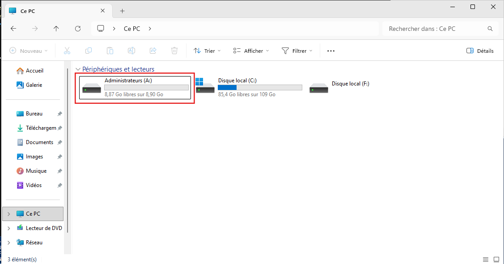
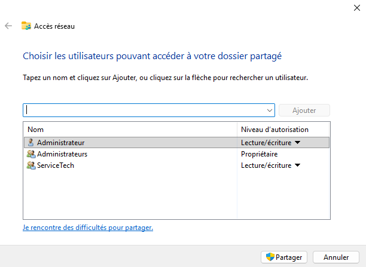
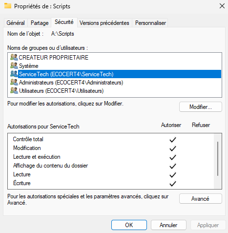

# Créer un lecteur réseau pour l'administration


---

> [!note] Informations
>
> - **Auteur :** Louis MEDO
> - **Date :** 29/09/2026
> - **Domaine :** Windows

---

## 1. Sommaire

- [1. Sommaire](#1-sommaire)
- [2. Contexte](#2-contexte)
- [3. Réduction de la partition système](#3-reduction-de-la-partition-systeme)
- [4. Provisionnement du lecteur](#4-provisionnement-du-lecteur)
- [5. Partage](#5-partage)

## 2. Contexte

Cette procédure détaille la réduction du volume système sur Windows Server 2025 pour provisionner un nouveau lecteur. Ce stockage réseau est ensuite partagé et sécurisé avec des accès restreints exclusivement au groupe `ServiceTech`.

## 3. Réduction de la partition système {#3-reduction-de-la-partition-systeme}

3.1. **Redimensionnement du volume C:.** Libération de l'espace disque afin de créer une zone non allouée.

**Vérifier l'état de votre stockage avant le redimensionnement :**

```powershell
Get-Volume
```

**Exemple de résultat :**

```powershell
DriveLetter FriendlyName          FileSystemType DriveType HealthStatus OperationalStatus SizeRemaining     Size
----------- ------------          -------------- --------- ------------ ----------------- -------------     ----
C                                 NTFS           Fixed     Healthy      OK                     94.36 GB 118.9 GB
                                  NTFS           Fixed     Healthy      OK                    147.26 MB   904 MB
```

**redimensionnement :**

```powershell
Resize-Partition -DriveLetter C -Size 80GB
```

- `Get-Volume` : Affiche la liste des volumes locaux, leur système de fichiers et l'espace disponible/total.
- `Resize-Partition` : Commande (cmdlet) modifiant la taille physique d'une partition existante.
- `-DriveLetter C` : Identifie le lecteur ciblé par l'opération.
- `-Size 80GB` : Définit la nouvelle taille absolue souhaitée pour la partition.

## 4. Provisionnement du lecteur

4.1. **Création et formatage.** Initialisation de la nouvelle partition sur l'espace disponible.

```powershell
New-Partition -DiskNumber 0 -UseMaximumSize -DriveLetter A | Format-Volume -FileSystem NTFS -NewFileSystemLabel "Administrateurs"
```

- `New-Partition` : Crée une nouvelle table de partitionnement.
- `-DiskNumber 0` : Cible le disque physique principal du serveur.
- `-UseMaximumSize` : Instruction pour consommer la totalité de l'espace libre.
- `-DriveLetter A` : Monte le volume en lui attribuant spécifiquement la lettre A.
- `|` (Pipeline) : Transmet l'objet créé à la commande suivante.
- `Format-Volume` : Prépare la partition à recevoir des données.
- `-FileSystem NTFS` : Système de fichiers requis pour une gestion stricte des permissions.
- `-NewFileSystemLabel` : Nomme le volume (ici "Admininistrateurs").

**Exemple de résultat :**


*Explorateur de fichier avec la partition "Administrateurs"*

## 5. Partage

5.1. **Déploiement du partage SMB.** Création du répertoire et verrouillage des accès pour l'équipe technique avec partage caché et énumération basée sur l'accès.

```powershell
New-Item -Path "A:\Scripts" -ItemType Directory
New-SmbShare -Name "PartageAdmin$" -Path "A:\Scripts" -FullAccess "ServiceTech" -FolderEnumerationMode AccessBased
```

- `New-Item` : Instancie un nouvel élément dans l'arborescence.
- `-Path "A:\Scripts"` : Définit l'emplacement cible.
- `-ItemType Directory` : Indique que l'élément à créer est un dossier.
- `New-SmbShare` : Crée le point de montage réseau via le protocole SMB.
- `-Name "PartageAdmin$"` : Nom de partage exposé sur le réseau. L'ajout du symbole `$` à la fin crée un partage administratif caché (invisible lors de la découverte réseau classique).
- `-FullAccess "ServiceTech"` : Attribue les droits NTFS et de partage "Contrôle Total" uniquement au groupe ciblé.
- `-FolderEnumerationMode AccessBased` : Active l'ABE (Access-Based Enumeration) pour masquer le contenu du partage aux utilisateurs ne possédant pas les droits de lecture sur les sous-dossiers.

**Résultat attendu :**


*Vérification des droits d'accès aux partages - Onglet partage > Option partage*

5.2. **Création des ACL sur le dossier.**

```powershell
$Acl = Get-Acl "A:\Scripts"
$AccessRule = New-Object System.Security.AccessControl.FileSystemAccessRule("ServiceTech", "FullControl", "ContainerInherit,ObjectInherit", "None", "Allow")
$Acl.SetAccessRule($AccessRule)
Set-Acl -Path "A:\Scripts" -AclObject $Acl
```

- `Get-Acl` : Récupère la liste de contrôle d'accès (ACL) actuelle du répertoire spécifié.
- `New-Object System.Security.AccessControl.FileSystemAccessRule` : Classe .NET permettant d'instancier une nouvelle règle d'accès. Ses arguments définissent le périmètre :
  - `"ServiceTech"` : Identité du groupe ciblé.
  - `"FullControl"` : Niveau de permission accordé (Contrôle total).
  - `"ContainerInherit,ObjectInherit"` : Flags d'héritage forçant l'application de la règle aux sous-dossiers et aux fichiers enfants.
  - `"None"` : Flags de propagation (aucune restriction de propagation ici).
  - `"Allow"` : Type d'autorisation (Autoriser).
- `$Acl.SetAccessRule($AccessRule)` : Méthode modifiant l'objet ACL en mémoire en y injectant la nouvelle règle configurée.
- `Set-Acl` : Applique l'objet ACL modifié sur le système de fichiers physique cible.

**Résultat attendu :**

.
*Vérification de la configuration des ACLs - Onglet sécurité du dossier \Scripts*
