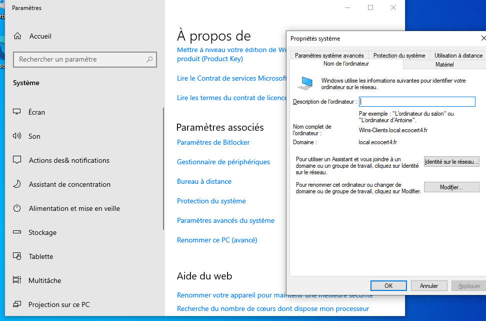
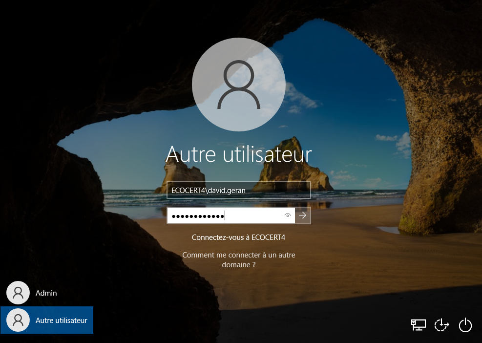
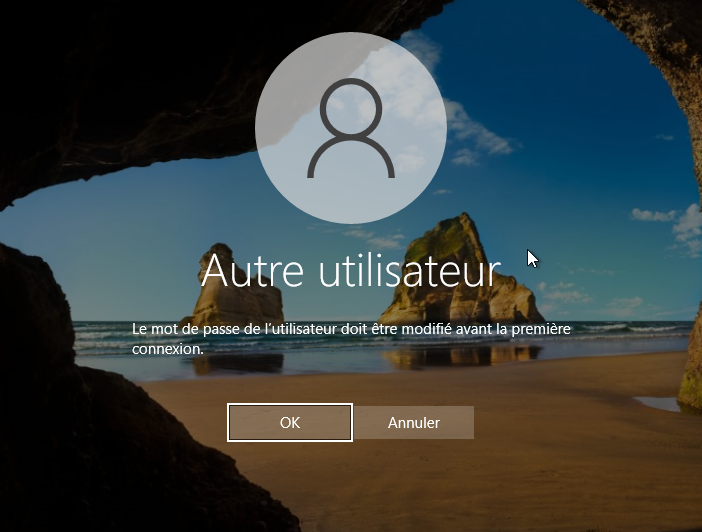
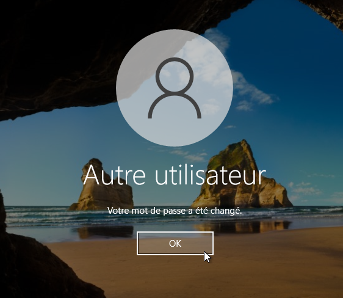
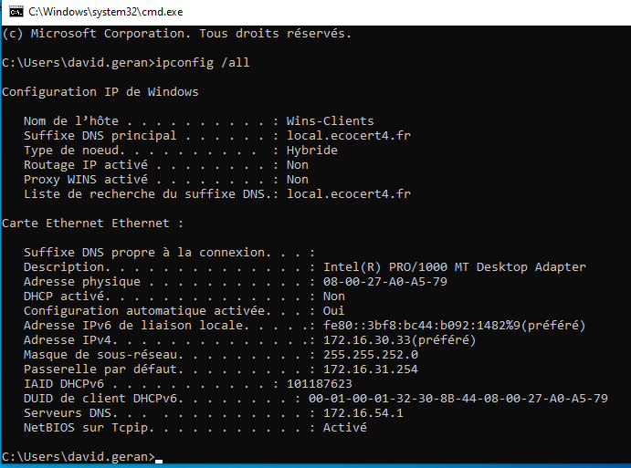

# Fiche recette de l'AD avec une machine cliente


---

- **Auteur :** Amine KADA
- **Date :** 14/09/2026
- **Domaine :** Windows serveur

---

## 1. Sommaire

- [1. Sommaire](#1-sommaire)
- [2. Contexte](#2-contexte)
- [3. Configuration réseau du poste client](#3-configuration-reseau-du-poste-client)
- [4. Intégration au domaine Active Directory](#4-integration-au-domaine-active-directory)
- [5. Validation et tests de connexion](#5-validation-et-tests-de-connexion)

## 2. Contexte

Validation du déploiement de l'Active Directory par l'intégration d'une machine cliente Windows. Cette fiche recette permet de s'assurer de la bonne communication réseau avec le contrôleur de domaine, de l'effectivité de la jonction au domaine `local.ecocert4.fr`, ainsi que du bon fonctionnement de l'authentification centralisée et de la politique de renouvellement de mot de passe à la première connexion des utilisateurs importés.

## 3. Configuration réseau du poste client {#3-configuration-reseau-du-poste-client}

3.1.  **Connexion locale.** Se connecter sur le compte local du poste client en utilisant le compte administrateur.

3.2.  **Configuration du serveur DNS.** Accéder aux paramètres de la carte réseau pour configurer manuellement le serveur DNS préféré afin qu'il pointe vers l'adresse IP du contrôleur de domaine.

!!! info "Paramètre réseau"
    Le serveur DNS préféré doit être défini sur `172.16.54.1`.

## 4. Intégration au domaine Active Directory {#4-integration-au-domaine-active-directory}

4.1.  **Renommage de la machine.** Aller dans les paramètres système du poste, puis cliquer sur "Renommer ce PC (avancé)". Définir un nom explicite pour la machine cliente afin de la référencer correctement dans l'annuaire.

4.2.  **Jonction au domaine.** Dans la même fenêtre, cliquer sur "Modifier" pour passer d'un groupe de travail (Workgroup) à un domaine. 



- `Domaine` : Saisir `local.ecocert4.fr`

4.3.  **Authentification d'intégration.** Une fenêtre d'authentification s'ouvre. Renseigner les identifiants de l'administrateur du domaine pour valider l'intégration. Redémarrer le poste une fois l'opération réussie.

## 5. Validation et tests de connexion

5.1.  **Test d'authentification utilisateur.** Après le redémarrage, tester la connexion avec l'un des utilisateurs importés dans l'AD en utilisant le format `prenom.nom` (par exemple : `david.geran`).



5.2.  **Changement obligatoire du mot de passe.** Lors de la première connexion, le système exige la modification du mot de passe (stratégie "L'utilisateur doit changer le mot de passe à la prochaine ouverture de session").



!!! success "Validation"
    Saisir un nouveau mot de passe. L'ouverture de la session confirme formellement que la machine cliente est correctement liée au service Active Directory du Windows Server.



5.3.  **Vérification de la configuration réseau.** Une fois sur la session, ouvrir un invite de commandes pour contrôler l'ensemble des paramètres IP appliqués au poste.

```cmd title="Terminal"
ipconfig /all
```



- `/all` : Affiche l'intégralité des informations de configuration réseau de la machine cliente (suffixe DNS, baux, serveurs DNS) permettant de certifier l'environnement réseau.
