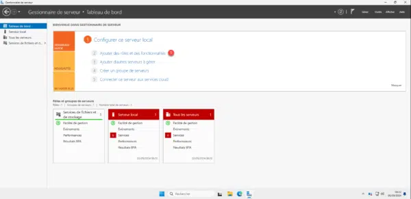
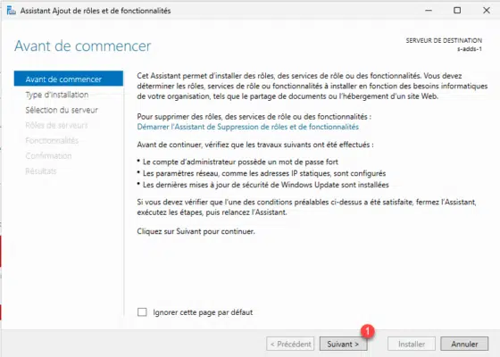
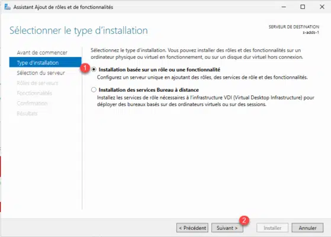
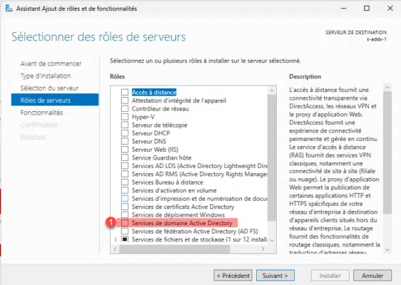
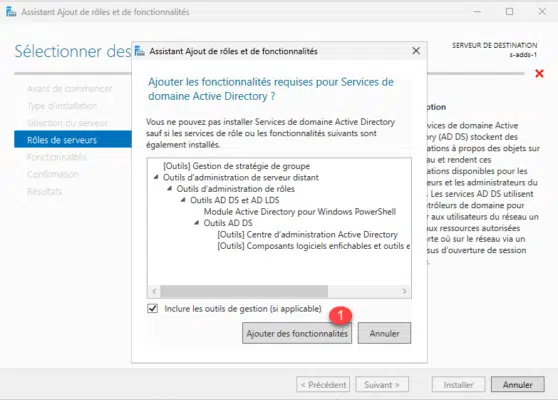
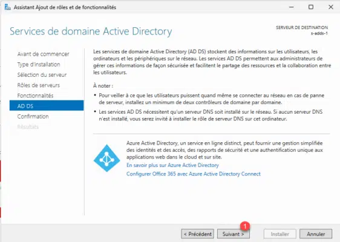
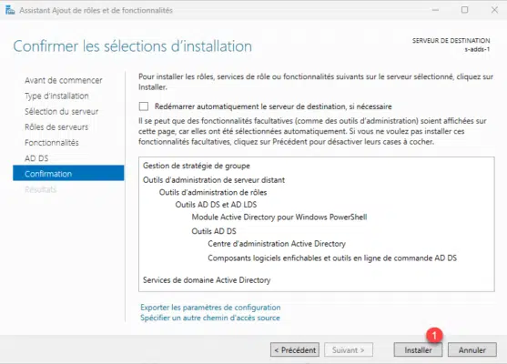

# Installation du rôle AD DS

---

- **Auteur :** Amine KADA
- **Date :** 14/09/2026
- **Domaine :** Windows serveur
---

## 1. Sommaire

- [1. Sommaire](#1-sommaire)
- [2. Contexte](#2-contexte)
- [3. Installation du rôle serveur](#3-installation-du-role-serveur)

## 2. Contexte

Ajout du rôle Services de domaine Active Directory (AD DS). Ce service agit en tant que pilier central pour l'authentification des utilisateurs, la gestion des politiques de sécurité et la centralisation des ressources de l'infrastructure Ecocert.

## 3. Installation du rôle serveur

3.1.  **Lancement de l'assistant d'ajout de rôles.** Depuis le Gestionnaire de serveur, démarrer l'assistant pour ajouter des rôles et des fonctionnalités.

3.2.  **Choix du type d'installation.** Sélectionner l'installation basée sur un rôle ou une fonctionnalité.

3.3.  **Sélection du serveur de destination.** Choisir le serveur local sur lequel déployer le rôle dans le pool de serveurs.

3.4.  **Sélection du rôle Services AD DS.** Cocher la case "Services AD DS" (Active Directory Domain Services) dans la liste des rôles.

3.5.  **Ajout des fonctionnalités associées.** Confirmer l'installation des fonctionnalités additionnelles requises (Outils de gestion RSAT).

3.6.  **Confirmation des sélections.** Passer les étapes intermédiaires, vérifier les options et confirmer l'installation.

3.7.  **Fin de l'installation du rôle.** Attendre la fin de l'installation puis repérer le lien permettant de promouvoir le serveur en contrôleur de domaine.

