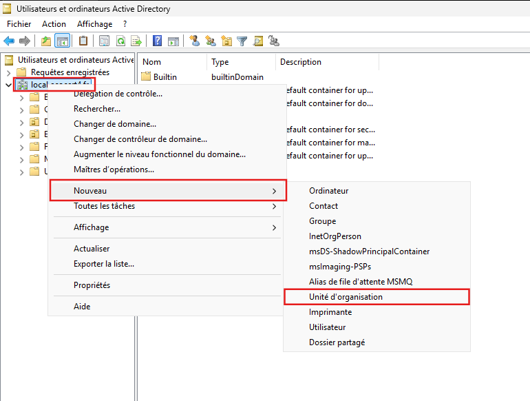

# Script de création et de modification des utilisateurs


---

!!! note "Informations"

    - **Auteur :** Louis MEDO
    - **Date :** 29/09/2026
    - **Domaine :** Windows

---

## 1. Sommaire

- [1. Sommaire](#1-sommaire)
- [2. Contexte](#2-contexte)
- [3. Création de l'OU racine ECOCERT](#3-creation-de-lou-racine-ecocert)
- [4. Architecture de l'OU ECOCERT](#4-architecture-de-lou-ecocert)
- [5. Fonctionnement et utilisation du script](#5-fonctionnement-et-utilisation-du-script)
- [6. Logique et fonctionnement technique du script](#6-logique-et-fonctionnement-technique-du-script)
- [7. Points de vigilance](#7-points-de-vigilance)

## 2. Contexte

Cette procédure décrit le déploiement et le fonctionnement du script d'automatisation pour la création et la modification des utilisateurs Active Directory. Le script PowerShell est idempotent et synchronise les comptes à partir d'un fichier source CSV. Il est accessible via le lecteur réseau réservé à l'équipe d'administration sous le chemin `A:/scripts/SyncUtilisateurs.ps1`, ou dans la documentation à l'adresse suivante : [SyncUtilisateurs.ps1](./assets/script-creation-modification-utilisateurs/SyncUtilisateurs.ps1) avec le fichier de données [UtilisateursEcocert.csv](./assets/script-creation-modification-utilisateurs/UtilisateursEcocert.csv).

## 3. Création de l'OU racine ECOCERT {#3-creation-de-lou-racine-ecocert}

Avant l'exécution du script, l'Unité Organisationnelle (OU) racine "Ecocert" doit impérativement exister dans l'Active Directory, le script ne la créant pas lui-même.

3.1. **Créer l'Unité Organisationnelle de base.** Ouvrir la console *Utilisateurs et ordinateurs Active Directory* (ADUC) pour configurer l'arborescence racine.

- Effectuer un clic droit sur le nom de domaine (`local.ecocert4.lan`).
- Aller dans **Nouveau** > **Unité d'organisation**.
- Nommer l'unité `Ecocert` et s'assurer que l'option de protection contre la suppression accidentelle est cochée.


*Interface ADUC lors de la création de l'OU Ecocert*

## 4. Architecture de l'OU ECOCERT

Le script génère dynamiquement la sous-arborescence pour chaque service identifié dans le fichier CSV. L'architecture cible au sein de l'annuaire est la suivante :

### 4.1. Arborescence Active Directory

```text
Ecocert/
  ServiceNom/
    Utilisateurs/
    Ordinateurs/
  ServiceNom/
    Utilisateurs/
    Ordinateurs/
```

!!! note "Gestion de l'arborescence"
    Le script PowerShell provisionne automatiquement les OUs "ServiceNom" et les sous-OUs "Utilisateurs" si elles sont manquantes lors du parcours du CSV. L'OU "Ordinateurs" doit être ajoutée via une autre procédure ou module d'automatisation.

## 5. Fonctionnement et utilisation du script

Le script analyse le fichier `UtilisateursEcocert.csv` (stocké dans le même répertoire que le script) pour vérifier, créer ou mettre à jour les utilisateurs. Il applique un formatage précis (UPN, e-mail) et génère un fichier de logs quotidien.

5.1. **Exécuter la synchronisation AD.** Depuis une console PowerShell lancée avec des privilèges d'administration, se rendre dans le répertoire du script et exécuter la commande.

**Exécution de SyncUtilisateurs.ps1 :**

```powershell
.\SyncUtilisateurs.ps1 -CsvPath ".\UtilisateursEcocert.csv" -Domaine "local.ecocert4.lan" -BaseOU "OU=Ecocert,DC=local,DC=ecocert4,DC=fr"
```

- `-CsvPath` : Spécifie le chemin d'accès vers le fichier CSV contenant la liste des utilisateurs.
- `-Domaine` : Définit le nom de domaine utilisé pour la génération des suffixes UPN et des adresses e-mail.
- `-BaseOU` : Détermine le Distinguished Name (DN) de l'Unité Organisationnelle racine dans laquelle l'arborescence sera déployée.

## 6. Fonctionnement du script {#6-logique-et-fonctionnement-technique-du-script}

Cette section détaille le flux d'exécution et les mécanismes de contrôle implémentés pour garantir la fiabilité et l'idempotence des opérations sur l'Active Directory.

6.1. **Journalisation.** Le script charge le module `ActiveDirectory` et déclare une fonction personnalisée `Write-Log`. Chaque action (succès, création, erreur, rejet) est horodatée et consignée dans un fichier texte local.

6.2. **Validation.** Le script vérifie la présence du fichier CSV (`Test-Path`). Il génère le `SamAccountName` (prenom.nom) et l'adresse e-mail en minuscules. Une validation par expression régulière est appliquée sur le champ téléphone ; en cas de non-conformité, l'enregistrement est ignoré via `Continue` et l'erreur est journalisée.

**Regex de validation téléphonique :**

```powershell
$User.Telephone -notmatch "^33 [1-9] \d{2} \d{2} \d{2} \d{2}$"
```

- `$User.Telephone` : Cible la propriété contenant le numéro de téléphone de l'utilisateur en cours de traitement (récupéré depuis le CSV).
- `-notmatch` : Opérateur de comparaison PowerShell qui renvoie un résultat positif (Vrai) si la valeur testée **ne correspond pas** à l'expression régulière (regex) qui suit.
- `^` : Marqueur regex indiquant le **début strict** de la chaîne (empêche qu'il y ait d'autres caractères avant le numéro).
- `33 ` : Exige littéralement les chiffres "33" suivis d'un espace (pour l'indicatif de la France).
- `[1-9]` : Exige exactement un chiffre compris entre 1 et 9 (garantit que le numéro ne commence pas par un zéro après l'indicatif).
- ` ` *(Espaces)* : Chaque espace dans l'expression exige la présence stricte d'un espace comme séparateur entre les blocs de chiffres.
- `\d{2}` : Correspond à **exactement deux chiffres** consécutifs de 0 à 9. Ce motif est répété quatre fois pour valider les quatre paires de chiffres restantes du numéro de téléphone.
- `$` : Marqueur regex indiquant la **fin stricte** de la chaîne (garantit qu'aucun chiffre ou caractère supplémentaire ne suit le dernier bloc de deux chiffres).

6.3. **Provisioning dynamique des unités organisationnelles.** Le script interroge l'AD (`Get-ADOrganizationalUnit`) pour vérifier l'existence de l'OU du service et de la sous-OU "Utilisateurs". Si absentes, il les crée à la volée (`New-ADOrganizationalUnit`).

6.4. **Gestion de l'idempotence.** Le cœur du script repose sur `Get-ADUser` pour déterminer si le compte existe.

- `New-ADUser` : Instanciation si le compte est inexistant.
- `Set-ADUser` : Mise à jour granulaire uniquement si une différence est détectée entre les attributs de l'AD et ceux du CSV (Email, Service, Téléphone, Fonction, Bureau) via une table de hachage dynamique.

## 7. Points de vigilance

!!! warning "Validation des numéros de téléphone"
    Le contrôle par regex (`^33 [1-9] \d{2} \d{2} \d{2} \d{2}$`). Un numéro mal formaté (ex: `33 6 12 34 56 78` au lieu de `33 6 12 34 56 78`) entraînera le rejet pur et simple de l'utilisateur.

7.1. **Mot de passe par défaut.** Les nouveaux comptes sont générés avec le mot de passe initial `ChangezMoiSVP@37ù`. L'option `ChangePasswordAtLogon = $true` est active pour forcer le changement à la première connexion.

7.2. **Consultation des logs.** En cas d'anomalie, analyser le fichier généré dans le répertoire courant (ex: `Sync-Users-2026-09-29-08-35.txt`), qui consigne avec précision chaque succès, avertissement ou échec.
