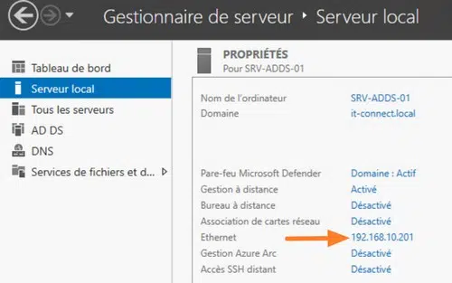
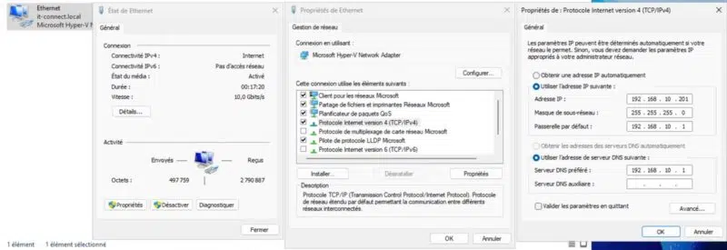

# Configuration réseau de l'AD

---

!!! note "Informations"

    - **Auteur :** Amine KADA
    - **Date :** 14/09/2026
    - **Domaine :** Windows Serveur 2025

---

## 1. Sommaire

- [1. Sommaire](#1-sommaire)
- [2. Contexte](#2-contexte)
- [3. Configuration IP statique](#3-configuration-ip-statique)

## 2. Contexte

Déploiement et configuration d'une adresse IP statique pour le futur contrôleur de domaine Active Directory. Cette étape est essentielle pour garantir la disponibilité permanente du serveur sur le réseau, car un contrôleur de domaine et serveur DNS ne doit pas dépendre d'une adresse IP dynamique fournie par le DHCP.

## 3. Configuration IP statique

3.1.  **Accès au Gestionnaire de serveur.** 
- Ouvrir le Gestionnaire de serveur pour accéder aux propriétés de la carte réseau locale et initier la configuration d'une IP statique.

3.2.  **Configuration des paramètres IPv4.**

- Dans les propriétés de la carte réseau, définir une adresse IP fixe, le masque de sous-réseau, la passerelle par défaut ainsi que le serveur DNS préféré (l'adresse locale loopback ou la propre adresse IP du serveur).

